# ZY2421109_胡代金_实验报告
# 实验一：软件需求分析与确认
## 一、目标系统概述  
目标系统是一个综合性阅读平台，支持用户创作、内容分享、社交互动及内容管理。系统分为**前台用户界面**和**后台管理界面**，满足普通用户的阅读/创作需求和平台管理员的内容治理需求。核心功能包括文章发布、社交互动（关注/点赞/评论）、内容审核、投稿推荐、笔记管理、举报机制等，旨在构建一个安全、高效、互动性强的阅读社区。
### 1、核心角色  
1. **用户**  
   - 注册/登录账户，管理个人信息。  
   - 发表/修改/删除文章及评论。  
   - 关注其他用户、点赞、收藏、提问、回答。  
   - 投稿至首页或专栏，管理个人笔记与浏览历史。  
   - 举报违规内容，屏蔽不感兴趣信息。  

2. **管理员**  
   - 审核用户投稿（首页/专栏），推送优质内容。  
   - 删除违规内容并通知用户。  
   - 管理用户权限（角色权限树状配置）。  
   - 监控平台数据（用户行为、内容质量）。  

---

### 2、核心功能模块  
| **模块**               | **功能描述**                                                                 |
|------------------------|----------------------------------------------------------------------------|
| **1. 账户管理**        | 注册、登录、密码修改（支持忘记密码重置）。                                  |
| **2. 社交互动**        | 关注/取消关注、点赞（公开计数）、评论（200字内文字评论，可删改）。           |
| **3. 内容创作**        | 发表文章（标题≤20字，内容≤2000字）、修改/删除自有内容。                     |
| **4. 内容分发**        | - 首页展示50条推荐内容（含浏览量/点赞量等）。<br>- 专栏投稿（管理员审核推送）。 |
| **5. 内容治理**        | - 用户举报违规内容（垃圾营销/违法信息等）。<br>- 管理员删除违规内容并通知用户。 |
| **6. 个人空间**        | - 笔记功能（编辑/导出PDF/删除）。<br>- 浏览历史记录（按日期查询）。           |
| **7. 搜索与发现**      | 支持标题/内容/用户名的模糊搜索，分页展示结果。                              |
| **8. 后台管理**        | - 权限树配置（用户/管理员角色权限）。<br>- 首页投稿审核/专栏内容管理。 
## 二、结构化自然语言建模**  
**1.1 目标系统的结构化自然语言需求**  
**用户需求**：  
1. 注册/登录/修改密码：用户可注册账户、登录系统、修改密码（含忘记密码功能）。  
2. 关注与粉丝管理：用户可关注/取消关注他人，查看关注列表和粉丝数量。  
3. 内容互动：用户可对文章点赞，实时显示点赞数。  
4. 评论管理：用户可发表评论（≤200字）、删除自己的评论。  
5. 内容发布：用户可发表文章（标题≤20字，内容≤2000字），自动记录发表时间。  
6. 内容管理：用户可修改或删除自己发表的文章（需确认提示）。  
7. 笔记功能：用户可对文章做笔记（≤2000字），导出PDF并删除笔记。  
8. 历史记录：用户可查看浏览历史，按日期筛选（每页50条）。  

**系统需求**：  
**功能需求（FR）**：  
1. FR1：首页展示50条文章（含时间、标题、作者、类型、浏览量、点赞数）。  
2. FR2：支持“更多”按钮分页加载文章。  
3. FR3：模糊搜索标题/内容/用户名。  
4. FR4：违规内容删除后自动通知用户。  
5. FR5：首页投稿审核（管理员推送或拒绝并反馈用户）。  
6. FR6：专栏投稿审核（专栏管理员通过/退回并通知）。  
7. FR7：举报功能（用户选择类型提交举报）。  
8. FR8：屏蔽功能（用户屏蔽不感兴趣内容）。  
9. FR9：提问与回答（用户发表问题/答案）。  
10. FR10：权限管理树（管理员配置角色访问权限）。  
**非功能需求（NFR）**：  
1. NFR1：响应时间≤2秒（浏览/搜索操作）。  
2. NFR2：数据加密存储（密码、用户信息）。  
3. NFR3：高并发支持≥1000用户同时在线。  
4. NFR4：兼容主流浏览器。  
5. NFR5：异常处理（输入超长内容时提示错误）。  
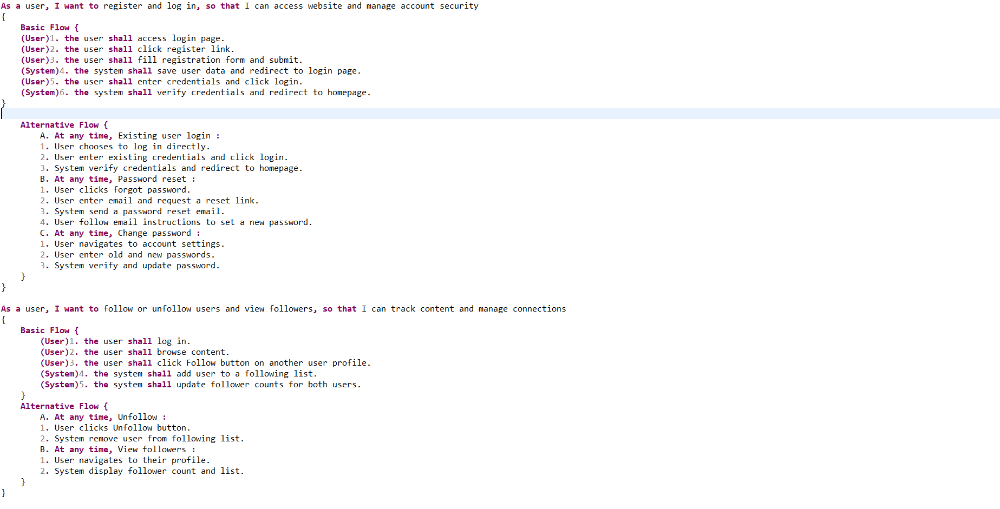  
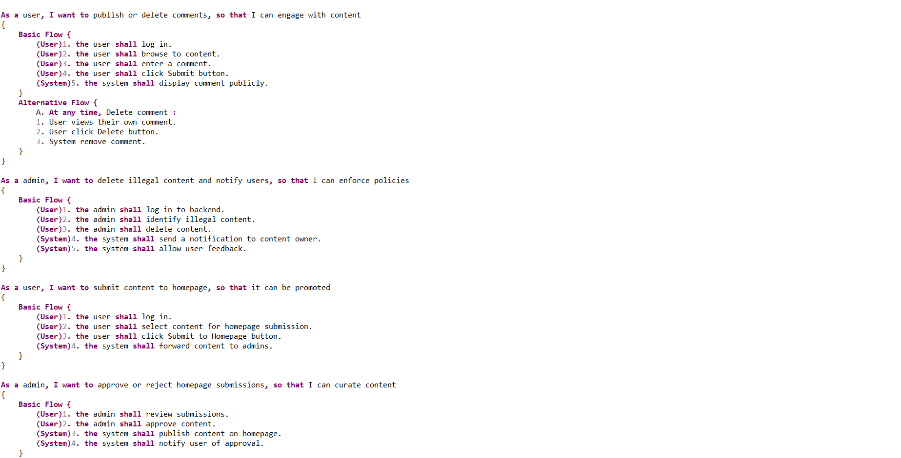 
---

**1.2 用例图**  
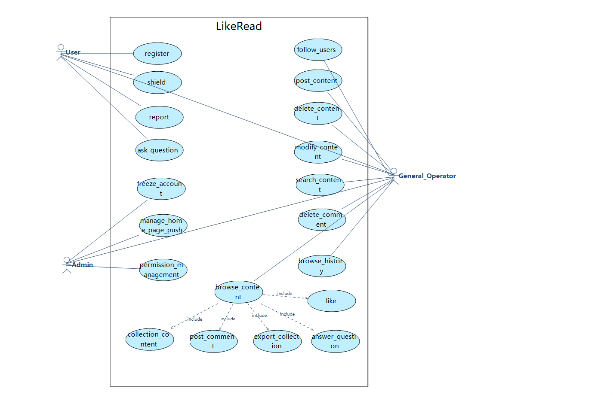  
**Actor**：`用户`（User）、`管理员`（Admin） 、`通用操作者`（General_Operator） 
**用例（6个）**：  
- `发表内容`（用户）→ **include** `登录验证`  
- `删除违规内容`（管理员）→ **extend** `发送通知`  
- `首页投稿审核`（管理员）→ **include** `推送至首页`  
- `浏览内容`（用户）→ **extend** `记录历史`  
- `关注用户`（用户）  
- `权限管理`（管理员）  

---

**1.3 系统顺序图**  
**示例1：用户发表文章**  
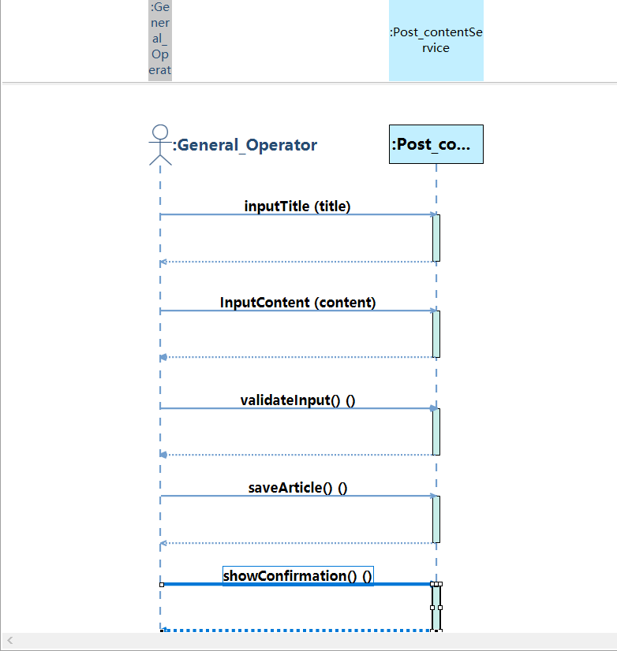  
- 用户操作：`输入标题和内容` → 系统操作：`validateInput()` → `saveArticle()` → `showConfirmation()`  

**示例2：用户注册**  
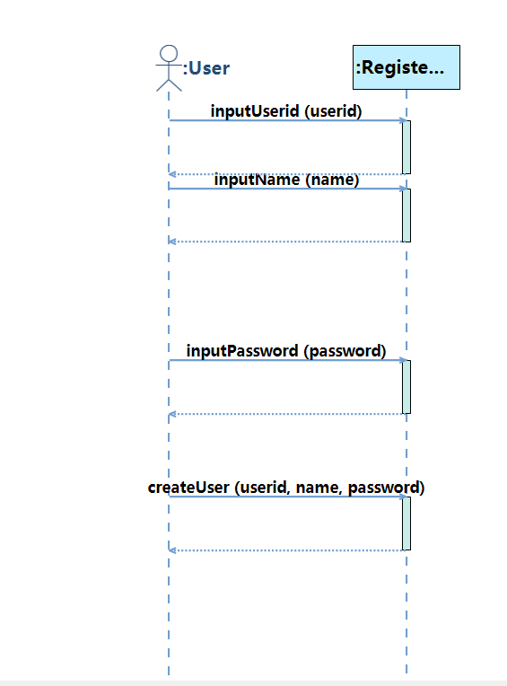  
- 用户操作：`inputUserid (userid)` → `inputName (name)`→ `inputPassword (password)`→系统操作：`createUser (userid,name,password)`  

**系统操作总数**：15个（如`login()`, `followUser()`, `exportNoteToPDF()`等
**关键业务规则**  ：
1. **内容约束**  
   - 文章标题≤20字，内容≤2000字；评论≤200字。  
   - 用户仅能修改/删除自有内容或评论。  
2. **投稿流程**  
   - 用户投稿 → 管理员审核 → 推送首页/专栏（或退回并通知用户）。  
3. **安全机制**  
   - 用户举报 → 管理员处理 → 系统通知违规用户 → 用户可申诉。  
4. **数据展示**  
   - 首页分页加载（每页50条），浏览历史分页查询（每页50条）。

**系统合约数量**：12个（如`precondition: 用户已登录`，`postcondition: 文章状态=已发布`）  

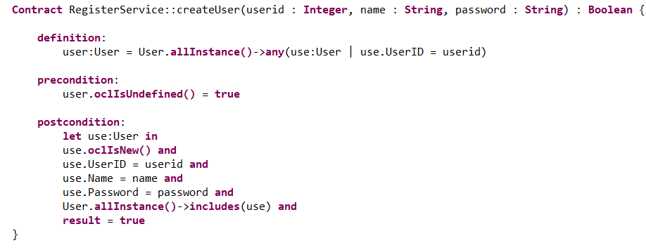 
---

**1.4 概念类图（实体关系分析）**  
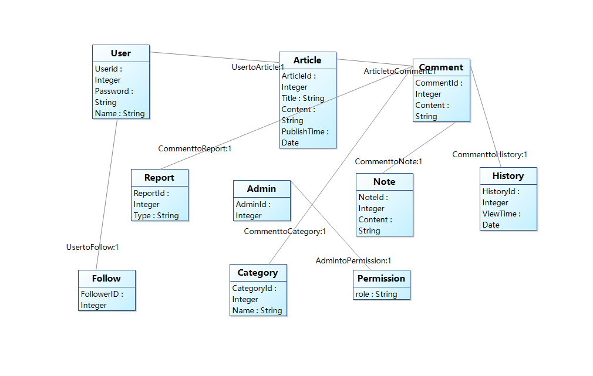  
**类（10个）**：  
```plaintext
User
- userId: String
- username: String
- password: String
+ login()
+ modifyProfile()

Article
- articleId: String
- title: String
- content: String
- publishTime: Date
+ publish()
+ delete()

Comment
- commentId: String
- content: String
+ addComment()
+ deleteComment()

Report
- reportId: String
- type: String
+ submitReport()

Admin
- adminId: String
+ manageUser()
+ setPermissions()

Follow (关联类)
- follower: User
- followed: User

Note
- noteId: String
- content: String
+ exportPDF()

History
- historyId: String
- viewTime: Date

Category
- categoryId: String
- name: String

Permission
- role: String
- accessTree: JSON
```  
**关系**：  
- `User` → `Article`（1对多：用户发表多篇文章）  
- `Article` → `Comment`（1对多：文章包含多条评论）  
- `User` → `Follow`（自关联：用户关注其他用户） 
---  
**模型规模统计**：  
| 项目                | 数量 |
|---------------------|------|
| 自然语言需求        | 23   |
| Actor               | 3    |
| 用例                | 6    |
| 系统顺序图（SSD）   | 4    |
| 系统操作            | 15   |
| 系统合约            | 12   |
| 类                  | 10   |

#### **2. RM2PT原型实现**  
**原型界面截图与功能演示**  
**用户注册**  
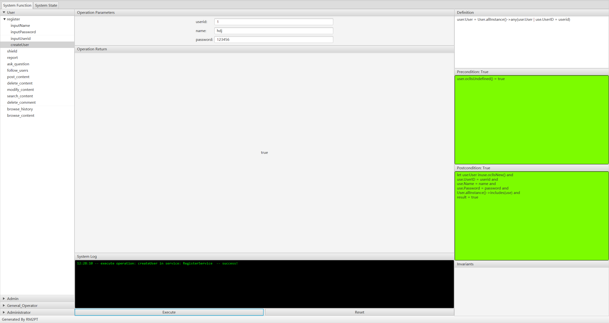  
- 功能：用户输入id, name, password，系统进行注册。  

# 实验二：RM2PT自动化架构设计和详细设计
## 架构设计自动生成（RapidMS）
右键RM2PT for Developer选中Generate Remodeltoreq Code,在生成的ReqModel文件夹中对生成的req文件右键RM2PT for Developer选中Generate Inital MicroService Model，生成最初的划分模型。
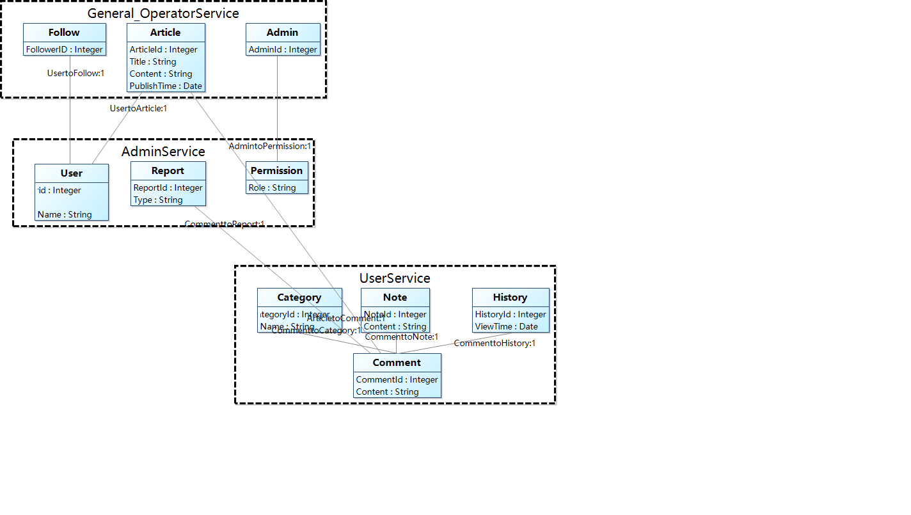 
在类图中中选择context新建一个服务，通过moveentity可以将实体调整到不同的服务当中。
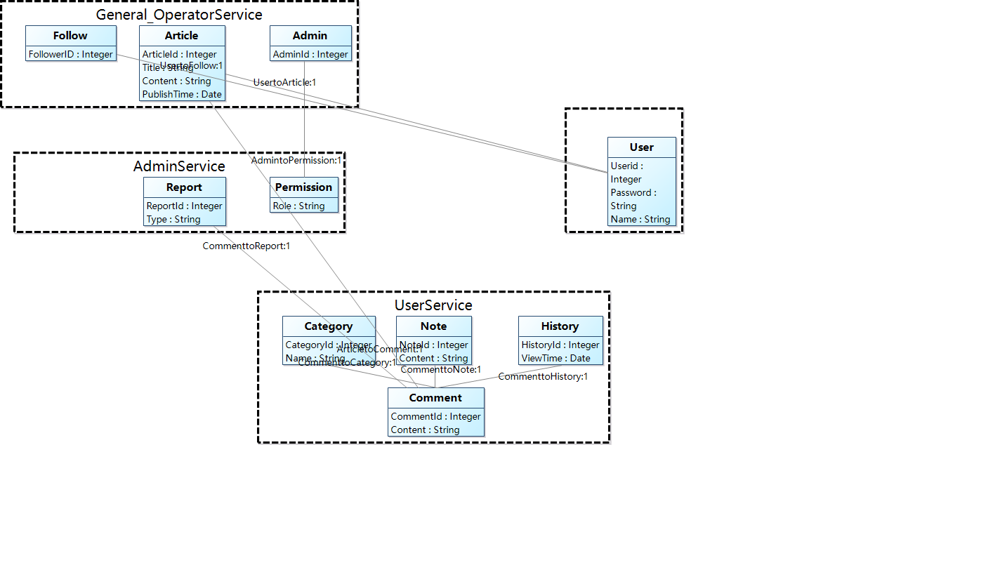 
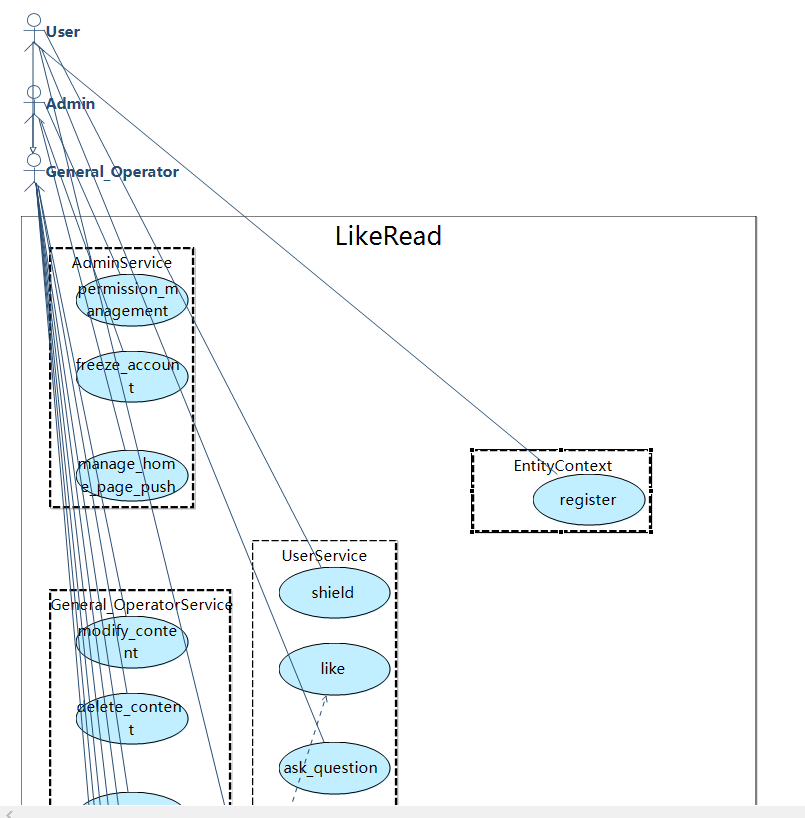 
打开metric视图或者外层的显示框看到不同指标的变化
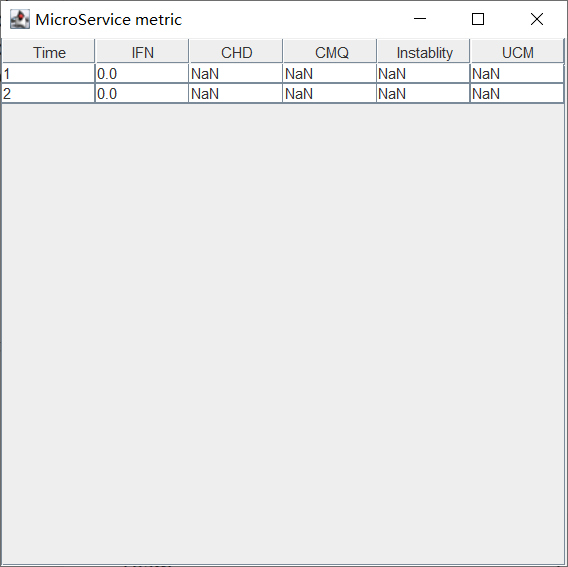 
对调整好的req模型右键RM2PT for Developer选中Generate MicroService Model，生成最后的微服务模型。
 

## 面向对象详细设计自动生成（RM2DM）
对实验一的需求模型，右键点击 likeread.remodel -> RM2PT-Dev -> Generate Design Model 从需求模型生成设计模型。
生成的类图
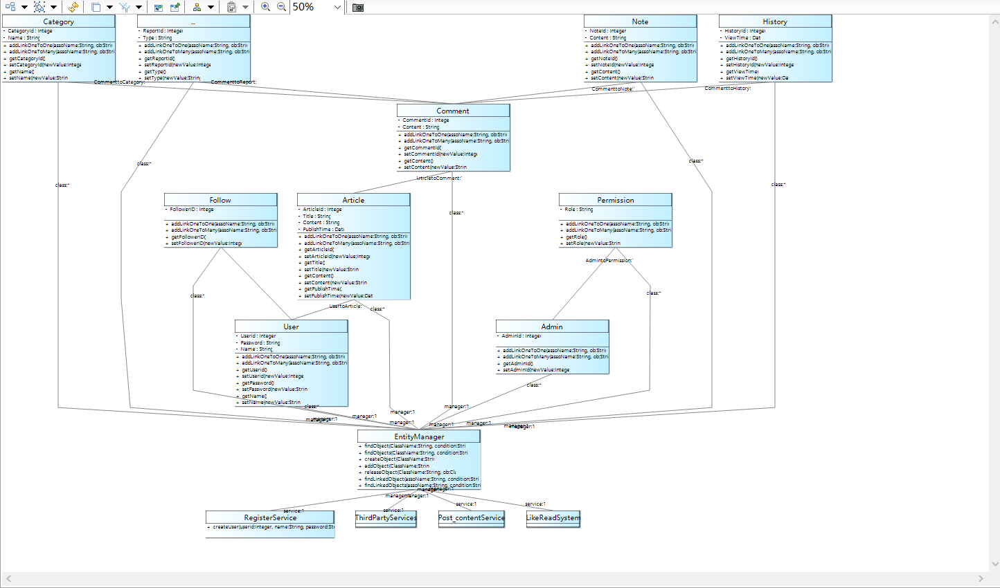 
生成的时序图
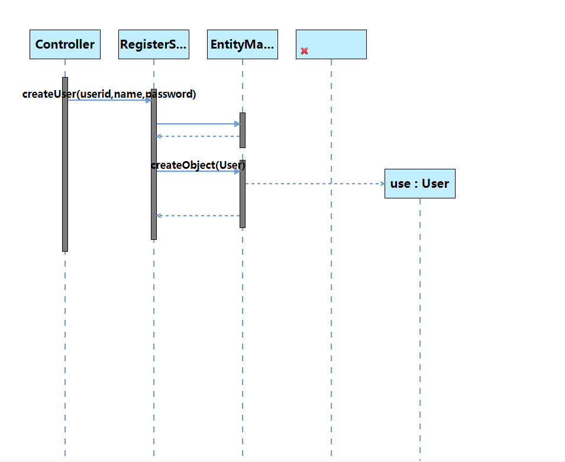 

## 大模型生成设计模型与微服务拆分


### 设计模型生成方案

#### 1. 大模型选择
- **模型**：GPT-4.5
- **选择理由**：强大的逻辑推理和代码生成能力，适合处理UML建模等结构化任务。

#### 2. 提示词设计
```prompt
你是一个软件架构师，请基于以下需求模型生成详细的设计模型：
1. **需求模型来源**：实验一通过RM2PT生成的UML模型（用例图、系统顺序图、概念类图）
2. **输入格式**：
   - 用例图：描述参与者与用例的关系
   - 系统顺序图：展示关键操作的交互流程
   - 概念类图：列出核心领域对象及其关系
3. **输出要求**：
   - 生成详细设计类图（包含方法签名）
   - 生成关键操作的序列图（设计级别）
   - 输出格式为JSON（包含classes和sequences）

示例输入：
{
  "use_case_diagram": "顾客->(浏览商品, 下单支付, 查看订单)",
  "system_sequence_diagram": {
    "下单支付": ["顾客: 提交订单", "系统: 生成支付链接", "支付网关: 处理支付"]
  },
  "concept_class_diagram": [
    {"class": "Customer", "attributes": ["id", "name"], "relations": ["1..* Order"]},
    {"class": "Order", "attributes": ["orderId", "total"], "relations": ["1..* OrderItem"]}
  ]
}
```

#### 3. 生成结果（JSON格式）
```json
{
  "design_classes": [
    {
      "class": "Customer",
      "attributes": ["id: String", "name: String", "email: String"],
      "methods": [
        "browseProducts(): Product[]",
        "placeOrder(items: CartItem[]): Order"
      ]
    },
    {
      "class": "OrderService",
      "methods": [
        "generatePaymentLink(orderId: String): PaymentLink",
        "updateOrderStatus(orderId: String, status: OrderStatus)"
      ]
    }
  ],
  "design_sequences": [
    {
      "scenario": "下单支付",
      "steps": [
        "Customer -> OrderService: placeOrder(cartItems)",
        "OrderService -> PaymentGateway: createPayment(order.total)",
        "PaymentGateway --> OrderService: paymentLink",
        "OrderService --> Customer: return paymentLink"
      ]
    }
  ]
}
```

---

### 微服务拆分方案

#### 1. 大模型选择
- **模型**：Claude 4 
- **选择理由**：擅长系统架构设计，对服务边界划分有深度优化。

#### 2. 提示词设计
```prompt
作为微服务架构师，请基于需求模型进行服务拆分：
1. **输入**：实验一生成的UML需求模型（重点分析概念类图的聚合根）
2. **拆分原则**：
   - 每个服务负责单一业务能力
   - 服务间通过API通信
   - 考虑领域驱动设计（DDD）的界限上下文
3. **输出要求**：
   - 服务列表（含职责描述）
   - 服务间依赖关系
   - 关键API端点定义
   - 输出格式为JSON

示例输入：
{
  "concept_class_diagram": [
    {"class": "Product", "relations": ["Catalog"]},
    {"class": "Order", "relations": ["Payment", "Inventory"]}
  ]
}
```

#### 3. 生成结果（JSON格式）
```json
{
  "microservices": [
    {
      "name": "ProductService",
      "responsibility": "商品目录管理",
      "apis": [
        "GET /products?category={id}",
        "POST /products (创建新品)"
      ]
    },
    {
      "name": "OrderService",
      "responsibility": "订单生命周期管理",
      "apis": [
        "POST /orders (创建订单)",
        "PUT /orders/{id}/status (更新状态)"
      ],
      "dependencies": ["PaymentService", "InventoryService"]
    },
    {
      "name": "PaymentService",
      "responsibility": "支付处理",
      "apis": [
        "POST /payments (发起支付)",
        "GET /payments/{id} (查询状态)"
      ]
    }
  ],
  "communication": {
    "sync": "RESTful API",
    "async": "消息队列（订单状态更新事件）"
  }
}
```

基于实验一的需求模型，通过GPT-4.5生成：
1. **设计类图**：
   - `Customer`类：含浏览商品、下单等方法
   - `OrderService`类：处理支付链接生成等业务逻辑
2. **序列图**：
   - 关键操作"下单支付"的详细交互流程
   - 包含与支付网关的跨系统调用

#### 微服务架构输出
通过Claude 4生成的微服务方案：
1. **服务划分**：
   - ProductService（商品核心域）
   - OrderService（订单协调器）
   - PaymentService（支付专有域）
2. **交互机制**：
   - 同步：REST API（如创建订单）
   - 异步：消息队列（状态更新事件）
3. **API设计**：
   - 每个服务提供明确端点（如`POST /orders`）
   - 服务间依赖符合DDD界限上下文原则

# 实验三：特定领域建模
## 任务1：Eclipse EMF元模型建模

---

#### 1. 所选目标模型说明  
**模型名称**：状态机（StateMachine）  
**领域描述**：  
状态机用于描述对象在生命周期内的状态变化，包含以下核心概念：  
- **状态（State）**：系统所处的条件（初始状态、普通状态、最终状态）  
- **转移（Transition）**：状态间的跳转规则  
- **事件（Event）**：触发转移的条件  
- **动作（Action）**：转移发生时执行的操作  
**参考文档**：[OMG State Machine规范](https://www.omg.org/spec/UML/2.5.1/PDF)  

---

#### 2. EMF元模型建模  
**元模型截图**：  
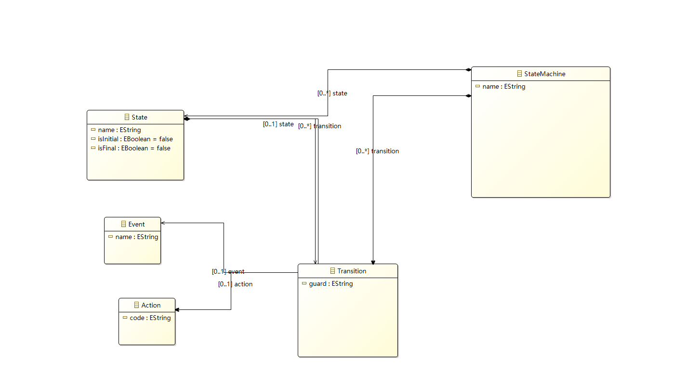  

**元模型核心要素**：  
```plaintext
StateMachine (根节点)
├── name: EString
├── states: State[0..*]
└── transitions: Transition[0..*]

State (抽象类)
├── name: EString
├── isInitial: EBoolean (初始状态标记)
├── isFinal: EBoolean (终止状态标记)
└── outgoingTransitions: Transition[0..*]

Transition
├── event: Event (触发事件)
├── guard: EString (守卫条件)
├── action: Action (执行动作)
├── source: State (源状态)
└── target: State (目标状态)

Event
└── name: EString

Action
└── code: EString (动作代码)
```
生成metamodel
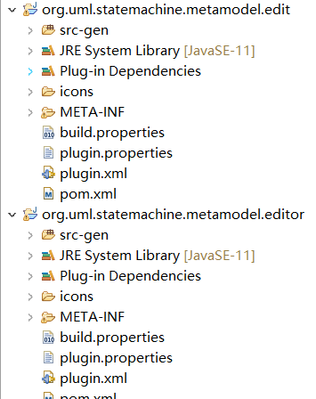 
使用元模型新建项目
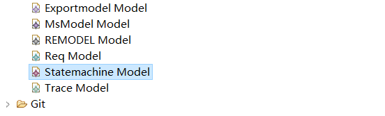 
对元模型进行建模
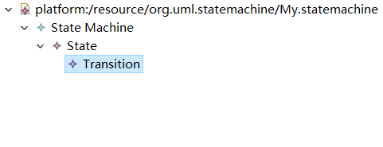 


## 任务2：Eclipse Sirius图形语言建模
双击viewpoint设置视点属性
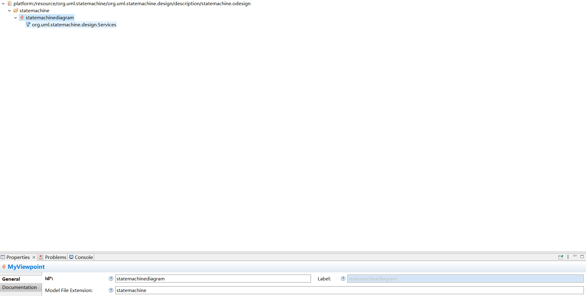
在视点中添加图，并且关联定义此图使用的类型的元模型
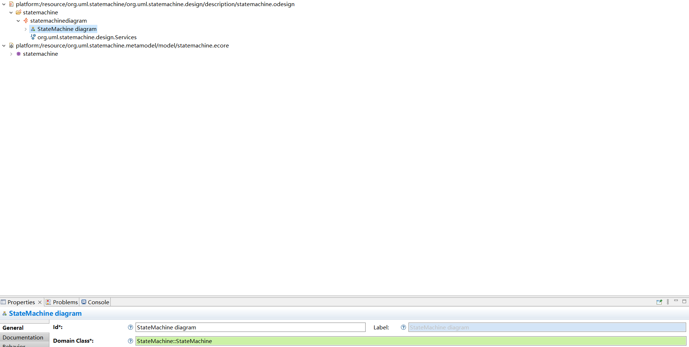
在图中添加节点并设置属性
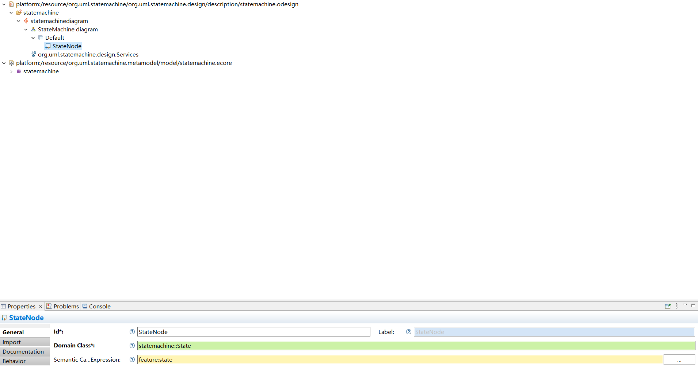
为节点设置样式
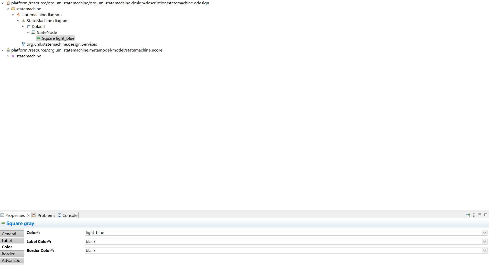
测试自己定义的图
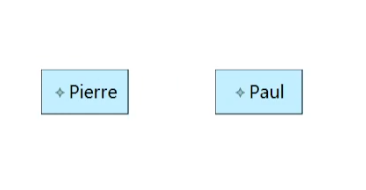

## 任务3：Eclipse Xtext文本语言建模
在已建好元模型的基础上，自动生成Xtext文件
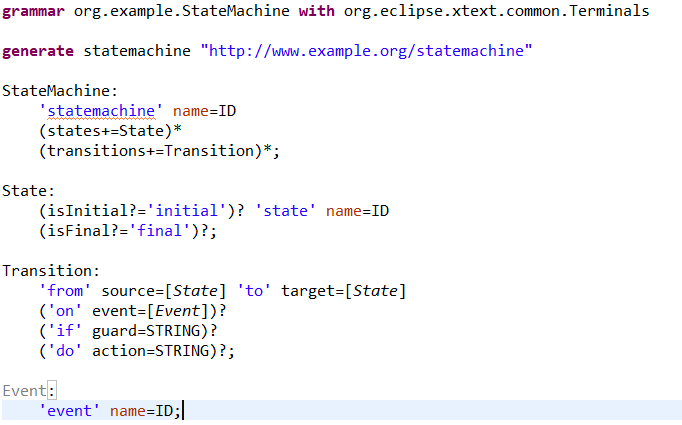

## 任务4：插件构建及测试
针对自选模型构建的项目打包为插件
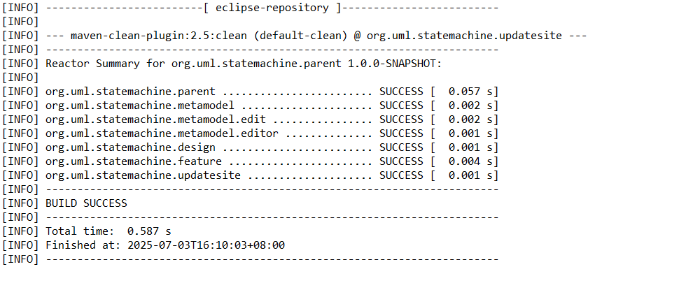
并进行测试
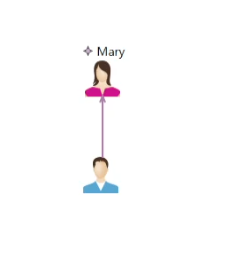


# 实验四：智能模型驱动
## 任务 1
使用curl 和 Python 等工具调用 OpenAI 的 API 生成需求模型
```
import subprocess
import shlex

curl_command = """
curl 'base_url/chat/completions' \
-H "Content-Type: application/json" \
-H "Authorization: Bearer api_key" \
-d '{
"model": "gpt-4o",
"messages": [
{
"role": "developer",
"content": "You are a helpful assistant."
},
{
"role": "user",
"content": "Analyze original requirements and identify core functional modules"
}
]
}'
"""

# 替换变量
curl_command = curl_command.replace("base_url", "https://api.chatfire.cn/v1").replace("api_key", "api_key")

# 执行命令
result = subprocess.run(shlex.split(curl_command), capture_output=True, text=True)
print(result.stdout)
```
生成结果
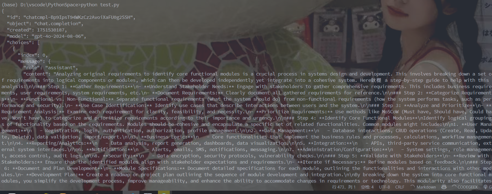

## 任务 2
使用 OpenAI SDK 调用 OpenAI 的 API 生成需求模型
```
from openai import OpenAI

client = OpenAI(
    api_key= "",
    base_url= "https://api.chatfire.cn/v1",
)

index = 1

with open(f'input_{index}.txt', 'r', encoding='utf-8') as file:
    user_content = file.read()

completion = client.chat.completions.create(
    model="o3",
    # model="gpt-4.5-preview",
    messages=[
    {"role": "system", "content": "You are a helpful assistant."},
    {"role": "user", "content": user_content}
    ],
    stream=True
)

with open(f'output_{index}.md', 'w', encoding='utf-8') as output_file:
    for chunk in completion:
        if chunk.choices[0].delta.content is not None:
            content = chunk.choices[0].delta.content
            print(content, end="")
            output_file.write(content)

```
生成原始需求的的Prompt设计如下：
```markdown
# 角色: 酒店领域需求分析师
## 任务
1. 解析原始需求，识别核心功能模块（必选：搜索/预订/支付/管理）
2. 每个模块拆解为原子性子功能
3. 标注功能优先级（P0/P1/P2）
4. 提取业务规则约束（如支付超时规则）

## 输入
{酒店预订系统是一个允许潜在客人通过在线平台搜索、查看、比较和预订酒店房间的软件系统。其核心功能包括：
房间搜索与浏览： 用户可按目的地、入住/退房日期、房型、价格范围、设施等条件搜索可用房间。
房间展示： 系统展示符合搜索条件的房间信息，包括房型描述、图片、价格、设施、用户评价等。
预订功能： 用户选择心仪房间后，输入入住人信息、联系方式、支付信息等完成预订流程。
订单管理： 用户和管理员可以查看、修改或取消已有的预订。
库存管理： 酒店管理员管理房间类型、数量、价格、房态以及促销活动。
用户账户管理： 用户注册、登录、管理个人信息和预订历史。
}

## 输出规范
{
  "system": "酒店预订系统",
  "modules": [
    {
      "name": "酒店搜索",
      "sub_functions": [
        {"name": "按地点搜索", "priority": "P0", "rules": ["支持城市/地标模糊搜索"]},
        {"name": "按日期筛选", "priority": "P0", "rules": ["入住日期>今天"]}
      ]
    },
    {
      "name": "在线支付",
      "sub_functions": [
        {"name": "信用卡支付", "priority": "P0", "rules": ["PCI-DSS合规","超时15分钟取消"]}
      ]
    }
  ]
}
```
生成需求模型的Prompt设计如下：
```markdown
请将以下需求描述的内容转化为结构化的用例描述部分，将中文的需求描述转化为英文，进行结构化自然语言需求的书写,并按照以下格式进行组织：
“示例：
As a user, I want to make a post, so that other users can view it
{
Basic Flow {
    (User)1. the user shall Log in to system website.
    (User)2. the user shall starts to make a new post.
    (User)3. the user shall entars title and content.
    (User)4. the user shall clicks Publish button.
    (System)5. When starts to make a new post, the ReadWebsite shall each post and display a description of post and time of publication.
    }
}

As a user, I want to make a post, so that other users can view it
{
Alternative Flow {
    A. At any time, System fails :
    To support recovery and correct accounting ensure all mansaction sensitive state and events can be recovered from any step of scenario.
    1.  User restarts System logs in and requests recovery of prior state.
    2.  System reconstructs prior state.
        a2.  System detects anomalies preventing recovery.
            1.  System signals error to user records error and enters a clean state.
    }
}

As a user, I want to browse Posts
{
Basic Flow {
    (User)1. the user shall Log in to system website.
    (User)2. the user shall Browse post titles and content profiles on homepage.
    (User)3. the user shall Skip to detail page by clicking on title or content profile.
    (System)4. When starts to skip to detail page, the ReadWebsite shall add content to user browsing history.
    (System)5. When starts to skip to detail page, the ReadWebsite shall show date of publication and author in title.
    (System)6. When browsing user own published content, the ReadWebsite shall display modify and delete buttons.
    }
}

As a user, I want to follow other users, so that directly find content pages of followed users 
{
Basic Flow {
    (User)1. the user shall Log in to system website.
    (User)2. the user shall browse post content.
    (User)3. the user shall click to follow this user.
    (System)4. When click on follow button, the ReadWebsite shall show followed users in user following history.
    (System)5. When starts to skip to detail page, the ReadWebsite shall show date of publication and author in title.
    (System)6. When browsing user own published content, the ReadWebsite shall display modify and delete buttons.
    }
}”
上部分采用基础用户故事形式，作为一个<用户角色>，我想要<完成活办，以便于实现价值。案例中As a xxx, I want to字段为必填项，注意：案例中灰色空格不可被忽略。
下部分采用基础EARS形式，本部分整体为选填项，当需要对用例进行内部描述时进行填写，其中NUM.后面的需要表述当前需求是用户需求还是系统需求(User/System)，另外案例中1. the xxx shall字段为必填项，注意：案例中空格不可被忽略。
具体的需求如下：
“角色定义
用户：网站的使用者、可以使用整个网站前台界面的全部功能，可在自己空间中对自己的信息、发表的内容和评论进行修改和删除。
管理员：网站后台的操作人员、负责后台功能的管理、包括用户管理、数据查询、权限管理等功能。
一．账户注册/登录/修改密码
用户通过账户注册模块注册账户，然后返回登录模块进行登录，如果已有账户的用户直接登录，登录成功后跳转到网站的首页。登录模块同时可以提供修改密码选项，如果用户忘记密码，可以点击忘记密码进行密码修改。
二．关注/取消关注/被关注
用户在网页浏览的过程中，对某个用户的文章或者发表的内容感兴趣，可以点击关注该用户，然后在用户的关注记录中显示已关注的用户。方便下次用户直接找到该用户的内容页面。用户同时可以对自己已关注的用户进行取消关注操作。用户界面还需要显示关注自己的人数信息。
三．点赞/被赞
用户可以对其他用户发表的内容点赞。点赞的次数对所有正在浏览该内容的用户都是可见的。
四．发表评论/删除评论/编辑内容
用户可以对他正在浏览的内容发表评论，对于评论字数限制在两百字内，评论内容目前只支持文字形式，不支持图片等其它格式，评论内容是公开的，浏览该内容的用户可以见到其它人对该内容的评论。同时用户可以删除自己发表的评论。
五．违规内容处理
管理员可以对用户发表的违法违规内容进行删除操作。并对违规操作的用户进行信息通知。用户可以通过。用户收到消息后，可以进行反馈。
六．首页投稿/管理首页推送
用户可以向首页投稿，管理员对用户发表的内容进行筛选，然后将一些好的文章推送到首页。也可以可以拒绝首页投稿，同时需要将相关内容反馈给用户，恭喜用户投稿成功，或者告知用户投稿失败，并鼓励用户继续加油。文章的来源可以是用户自己的投稿或者是来自于其它专题管理人员推荐的内容。
七．专栏管理
用户可以向相关的专栏投稿。专栏管理员需要对内容进行审核，对通过审核的文章被推送至对应专栏，并发通知告诉用户文章通过审核，不符合的文章退回，同时向用户发送通知文章未通过。
八．首页展示
首页为网站的门户，首页负责展示信息，用户可以通过首页点击感兴趣的信息跳转至详情页面，在详情页面浏览阅读文章内容，首页展示50条内容，每条内容包含如下信息：发表时间、文章名称、发表文章用户、文章所属类型、文章浏览量、点赞数量以及收藏数量。在首页底部有更多按钮，如果用户希望继续向下浏览，可以点击更多向后台获取更多文章数量。
九．	发表内容
用户必须输入标题和内容，点击发表后，自动生成发表时间，将数据存入数据库，之后可以被搜索和查看。标题不能超过20字，内容不能超过2000字。完成后返回主页。

十．	删除内容
用户可以点击删除按钮删除相应的内容。需要有确认提示。只能删除自己发表的内容。

十一．	修改内容
用户点击修改后可对已经发表的标题和内容进行修改，不许为空。只能修改自己发表的内容。标题不能超过20字，内容不能超过2000字。点击保存时需要有确认提示。
十二．	浏览内容
用户可以浏览标题和内容简介，点击标题或内容简介可以跳转到详细页面。并将该内容加入历史记录。每页30条。标题方应有发表时间和作者。当浏览用户自己发表的内容时，还应有修改、删除按钮。

十三．	搜索内容
用户在搜索框内输入字符串，点击搜索后，将对标题、内容和用户名以模糊查询的方式进行查询。

十四．	对感兴趣做笔记，并排版导出
用户在某一内容界面点击做笔记后将该内容加入笔记中。之后可在笔记界面修改内容，不能超过2000字，可以点击导出将内容以pdf格式导出到本地。可对笔记进行删除操作，需要有确认提示。

十五．	浏览历史纪录
用户可以查看最近的浏览的标题、内容、作者、浏览时间，或根据日期进行查询。每页50条。

十六．	权限管理
管理员可对用户和管理员两个角色可访问的模块进行修改，以树状图表示。

十七．	举报功能
用户浏览信息发现涉及垃圾营销、不实信息、有害信息、违法信息、淫秽色情、人身攻击、抄袭、违规等信息时，点击举报，页面跳转至举报页面。用户选择举报类型，点击 “举报”，举报该信息。
十八．	屏蔽功能
用户浏览信息发现自己不感兴趣的信息，点击“屏蔽”将信息屏蔽。
十九．	提问功能
用户可以进行“提问”，点击“提问”进入提问页面，输入问题，点击 “发表”即可将问题发表出来。
二十．	回答功能
用户可对其他用户的提问进行解答，用户发现自己可解答的问题，点击“回答”进入解答页面，输入答案，点击发表，将答案发表出来。
”
最终输出且只输出所要求的结构化的自然语言需求（英文）
```
生成的结果如下：
```json
{
  "system": "酒店预订系统",
  "modules": [
    {
      "name": "房间搜索与浏览",
      "sub_functions": [
        {"name": "按目的地搜索",       "priority": "P0", "rules": ["支持城市/地标/酒店名称关键字模糊搜索"]},
        {"name": "按入住/退房日期筛选", "priority": "P0", "rules": ["入住日期≥今天","退房日期>入住日期"]},
        {"name": "按房型/人数筛选",     "priority": "P0", "rules": ["房型与入住人数匹配"]},
        {"name": "按价格区间筛选",      "priority": "P1", "rules": ["价格区间下限<上限"]},
        {"name": "按设施筛选",          "priority": "P1", "rules": ["设施多选; 结果取交集"]},
        {"name": "结果排序与分页",       "priority": "P1", "rules": ["默认按推荐排序","支持价格/评分排序","单页≤50条"]},
        {"name": "房间详情展示",        "priority": "P0", "rules": ["展示图片≥3张","显示实时价格和房态"]},
        {"name": "用户评价展示",        "priority": "P2", "rules": ["最新评价置顶","过滤敏感词"]}
      ]
    },
    {
      "name": "预订",
      "sub_functions": [
        {"name": "入住人信息填写",      "priority": "P0", "rules": ["姓名必填","联系方式格式校验"]},
        {"name": "实时库存校验&锁定",  "priority": "P0", "rules": ["锁定库存15分钟","超时自动释放"]},
        {"name": "价格锁定",            "priority": "P0", "rules": ["锁价时长=库存锁定时长"]},
        {"name": "订单生成",            "priority": "P0", "rules": ["生成唯一订单号","状态=待支付"]},
        {"name": "预订确认通知",        "priority": "P0", "rules": ["邮件+短信发送","24h内可重发"]},
        {"name": "修改/取消申请",       "priority": "P1", "rules": ["仅在可退改政策范围内允许","超时或不可退房型提示拒绝"]},
        {"name": "多房间合并预订",      "priority": "P2", "rules": ["同一酒店可合并","入住日期需一致"]}
      ]
    },
    {
      "name": "在线支付",
      "sub_functions": [
        {"name": "信用卡支付",          "priority": "P0", "rules": ["PCI-DSS合规","3-D Secure 验证","支付超时15分钟自动取消订单"]},
        {"name": "第三方支付(支付宝/微信)", "priority": "P0", "rules": ["调用网关接口","支付超时15分钟自动取消订单"]},
        {"name": "预授权/担保",         "priority": "P1", "rules": ["入住前T日自动扣款","失败则取消预订"]},
        {"name": "优惠券/促销码抵扣",   "priority": "P1", "rules": ["同一订单不可叠加多张优惠券","优惠金额≤订单总价"]},
        {"name": "多币种结算",          "priority": "P2", "rules": ["汇率来源=当日牌价","展示本币与结算币金额"]},
        {"name": "退款处理",            "priority": "P0", "rules": ["原路退回","T+N工作日到账"]}
      ]
    },
    {
      "name": "管理",
      "sub_functions": [
        {"name": "订单查看",            "priority": "P0", "rules": ["用户仅可见本人订单","管理员可按多维度搜索"]},
        {"name": "订单修改/取消",       "priority": "P0", "rules": ["遵循房型退改规则","修改需重新校验库存与价格"]},
        {"name": "房态与库存管理",      "priority": "P0", "rules": ["支持日历式批量更新","库存变更实时同步"]},
        {"name": "价格和促销管理",      "priority": "P1", "rules": ["支持每日/区间价","促销与黑名单日期冲突时以高价为准"]},
        {"name": "用户账户管理",        "priority": "P0", "rules": ["邮箱/手机号唯一","密码加盐加密"]},
        {"name": "角色与权限管理",      "priority": "P1", "rules": ["最小权限原则","支持自定义角色"]},
        {"name": "数据报表",            "priority": "P2", "rules": ["导出CSV","数据刷新周期=日"]}
      ]
    }
  ]
}
```
## 任务 3
MultiAgent Workflow的框架为AutoGen，MultiAgent Workflow的流程如下：
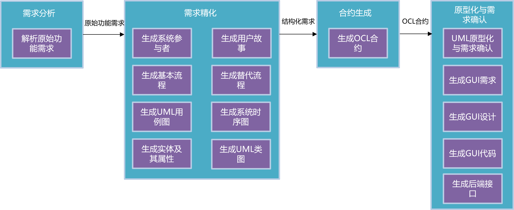
1. 解析原始功能需求
Prompt设计如下：
```markdown
# 角色: 酒店领域需求分析师
## 任务
1. 解析原始需求，识别核心功能模块（必选：搜索/预订/支付/管理）
2. 每个模块拆解为原子性子功能
3. 标注功能优先级（P0/P1/P2）
4. 提取业务规则约束（如支付超时规则）

## 输入
{原始需求文本}

## 输出规范
{
  "system": "酒店预订系统",
  "modules": [
    {
      "name": "酒店搜索",
      "sub_functions": [
        {"name": "按地点搜索", "priority": "P0", "rules": ["支持城市/地标模糊搜索"]},
        {"name": "按日期筛选", "priority": "P0", "rules": ["入住日期>今天"]}
      ]
    },
    {
      "name": "在线支付",
      "sub_functions": [
        {"name": "信用卡支付", "priority": "P0", "rules": ["PCI-DSS合规","超时15分钟取消"]}
      ]
    }
  ]
}
```
生成结果如下：
```json
{
  "system": "酒店预订系统",
  "modules": [
    {
      "name": "房间搜索与浏览",
      "sub_functions": [
        {"name": "按目的地搜索",       "priority": "P0", "rules": ["支持城市/地标/酒店名称关键字模糊搜索"]},
        {"name": "按入住/退房日期筛选", "priority": "P0", "rules": ["入住日期≥今天","退房日期>入住日期"]},
        {"name": "按房型/人数筛选",     "priority": "P0", "rules": ["房型与入住人数匹配"]},
        {"name": "按价格区间筛选",      "priority": "P1", "rules": ["价格区间下限<上限"]},
        {"name": "按设施筛选",          "priority": "P1", "rules": ["设施多选; 结果取交集"]},
        {"name": "结果排序与分页",       "priority": "P1", "rules": ["默认按推荐排序","支持价格/评分排序","单页≤50条"]},
        {"name": "房间详情展示",        "priority": "P0", "rules": ["展示图片≥3张","显示实时价格和房态"]},
        {"name": "用户评价展示",        "priority": "P2", "rules": ["最新评价置顶","过滤敏感词"]}
      ]
    },
    {
      "name": "预订",
      "sub_functions": [
        {"name": "入住人信息填写",      "priority": "P0", "rules": ["姓名必填","联系方式格式校验"]},
        {"name": "实时库存校验&锁定",  "priority": "P0", "rules": ["锁定库存15分钟","超时自动释放"]},
        {"name": "价格锁定",            "priority": "P0", "rules": ["锁价时长=库存锁定时长"]},
        {"name": "订单生成",            "priority": "P0", "rules": ["生成唯一订单号","状态=待支付"]},
        {"name": "预订确认通知",        "priority": "P0", "rules": ["邮件+短信发送","24h内可重发"]},
        {"name": "修改/取消申请",       "priority": "P1", "rules": ["仅在可退改政策范围内允许","超时或不可退房型提示拒绝"]},
        {"name": "多房间合并预订",      "priority": "P2", "rules": ["同一酒店可合并","入住日期需一致"]}
      ]
    },
    {
      "name": "在线支付",
      "sub_functions": [
        {"name": "信用卡支付",          "priority": "P0", "rules": ["PCI-DSS合规","3-D Secure 验证","支付超时15分钟自动取消订单"]},
        {"name": "第三方支付(支付宝/微信)", "priority": "P0", "rules": ["调用网关接口","支付超时15分钟自动取消订单"]},
        {"name": "预授权/担保",         "priority": "P1", "rules": ["入住前T日自动扣款","失败则取消预订"]},
        {"name": "优惠券/促销码抵扣",   "priority": "P1", "rules": ["同一订单不可叠加多张优惠券","优惠金额≤订单总价"]},
        {"name": "多币种结算",          "priority": "P2", "rules": ["汇率来源=当日牌价","展示本币与结算币金额"]},
        {"name": "退款处理",            "priority": "P0", "rules": ["原路退回","T+N工作日到账"]}
      ]
    },
    {
      "name": "管理",
      "sub_functions": [
        {"name": "订单查看",            "priority": "P0", "rules": ["用户仅可见本人订单","管理员可按多维度搜索"]},
        {"name": "订单修改/取消",       "priority": "P0", "rules": ["遵循房型退改规则","修改需重新校验库存与价格"]},
        {"name": "房态与库存管理",      "priority": "P0", "rules": ["支持日历式批量更新","库存变更实时同步"]},
        {"name": "价格和促销管理",      "priority": "P1", "rules": ["支持每日/区间价","促销与黑名单日期冲突时以高价为准"]},
        {"name": "用户账户管理",        "priority": "P0", "rules": ["邮箱/手机号唯一","密码加盐加密"]},
        {"name": "角色与权限管理",      "priority": "P1", "rules": ["最小权限原则","支持自定义角色"]},
        {"name": "数据报表",            "priority": "P2", "rules": ["导出CSV","数据刷新周期=日"]}
      ]
    }
  ]
}
```
2. 生成系统参与者
Prompt设计如下：
```markdown
# 角色
你是一名软件需求工程师，你的任务是对用户给出的目标软件系统的用途进行分析，推测其功能需求，总结出可能涉及的参与者，并根据用户的意见对其进行修改。
# 输出格式
系统参与者是一个用户角色，是可能会使用这款软件的人。例如对于一款音乐软件，可能涉及的参与者有音乐制作人、歌手、听歌用户等等。
# 注意事项
系统参与者要尽量清晰易懂，你需要对用户输入的需求进行拆解，考虑用户输入需求可能涉及到的参与者，保证考虑全面。参与者生成3个即可。
以下是目标软件的名称和系统用途，总结可能涉及的参与者：
 {system_desc}
[用户需求部分结束]
# 要求：
# 1. 每个参与者必须包含“actor”和“description”字段。
# 2. 您必须返回一个包含字典的列表，而不是包含列表的字典。
# 3. 参与者数量应在3到5之间。
# 4. 预期返回格式示例：
#    [{{"actor": "运动爱好者", "description": "主要使用运动功能的用户"}}, ...]            
# 以JSON格式返回
```
生成结果如下：
```json
[
  {
    "actor": "住客",
    "description": "通过搜索、筛选、下单与支付等功能完成酒店预订的终端用户"
  },
  {
    "actor": "酒店工作人员",
    "description": "在后台维护房态与库存、房价和促销信息，并处理订单修改或取消申请的酒店方用户"
  },
  {
    "actor": "平台运营管理员",
    "description": "负责系统运维、角色与权限配置、用户账户管理以及生成业务数据报表的后台管理人员"
  }
]
```
3. 生成用户故事
Prompt设计如下：
```markdown
# 角色
            你是一名软件需求工程师，你的任务是对用户给出的目标软件系统的用途进行分析，推测其功能需求，对于用户给你的系统参与者可能涉及的功能总结出2-3条用户故事。
# 输出格式
            用户故事的形式为：作为一个<用户角色>, 我想要<完成活动>, 以便于<实现价值>。<前置条件>，<后置条件>。
            一个完整的用户故事包含五个要素：
            角色：谁要使用这个
            活动：要完成什么活动
            价值：为什么要这么做，能带来什么价值
            前置条件：这么做之前需要满足什么条件
            后置条件：这么做之后应该满足什么条件
# 注意事项
            用户故事要尽量清晰易懂，你需要对用户输入的需求进行拆解，拆解成软件的多个功能需求，针对每个功能需求与用户输入的参与者进行匹配，生成一组涉及参与者的多条用户故事。用户故事尽量全面，覆盖完整的功能需求。生成的用户故事必须与指定的参与者相关。
            以下是目标软件的系统用途，请分析其功能需求，并以用户故事的形式进行总结：
            {system_desc}
以下是用户输入的参与者，你需要分析该参与者在这款目标软件中可能涉及的多条用户故事，并进行总结：
            {actor}
请以字符串数组的形式输出结果，数组中的每一项为一个用户故事。
# 要求：
            # 1. 每个用户故事必须仅包含一个字段“user_story”，并以一句话清晰简洁地表达，遵循标准用户故事格式。
            # 2. 每个用户故事指定的参与者相关，即<用户角色>部分必须与输入的参与者一致。
            # 3. 用户故事数量应介于2到5之间。
            # 4. 您必须返回一个包含字典的列表，而不是包含列表的字典。
            # 5. 预期格式示例：
            #    [{{"user_story": "作为一个运动爱好者，我希望能够添加和编辑运动记录，以便于记录每次运动的详细信息。前置条件：用户已登录且在运动记录页面。后置条件：运动记录被成功添加或更新。"}}, ...]
            以JSON格式返回
```
生成结果如下：
```json
[
  {"user_story": "作为一个住客，我想要按目的地、日期和人数搜索并预订房间，以便于快速找到合适房型并在价格库存锁定期内完成支付。前置条件：住客已登录且位于房间搜索页面。后置条件：系统生成唯一待支付订单并锁定对应库存与价格15分钟。"},
  {"user_story": "作为一个酒店工作人员，我想要在日历视图中批量更新房态与库存，以便于实时同步可售房量并减少人工错误。前置条件：工作人员已通过后台账号登录且拥有房态管理权限。后置条件：最新房态与库存信息即时保存并同步到前端搜索结果。"},
  {"user_story": "作为一个平台运营管理员，我想要为不同岗位创建自定义角色并配置最小权限，以便于保障系统安全并满足精细化运维管理。前置条件：管理员已登录管理后台且具有角色管理权限。后置条件：新角色及权限配置被成功保存并可分配给目标用户账户。"}
]
```
4. 生成基本流程
Prompt设计如下：
```markdown
# 角色
            你是一名软件需求工程师，你的任务是为目标软件系统的用户故事编写对应的基本流程，以描述用户与系统的交互流程。
# 输出格式
            基本流程包含两部分：用户需求与系统需求。
# 示例
            用户故事的基本流程的一个示例为：
            [用户故事]安排运动计划：
            [系统1]首先显示所有可计划的运动项目，
            [用户1]可以在系统上选择这些项目之一，
            [系统2]随后给出选定项目的可计划指标，
# 注意事项
            对于输入的每一条用户故事都应该生成一条基本流程。
            你的任务是为目标软件系统的用户故事编写对应的基本流程，以描述用户与系统的交互流程。
            以下是目标软件的系统用途，请分析其功能需求： {system_desc}
            [用户需求部分结束]
            以下是用户故事：{user_story}
            [用户故事部分结束]
            以下是该用户故事对应的参与者：{actor}
            [参与者部分结束]
请以字符串数组的形式输出结果，数组中的每一项为一个基本流程，其顺序与用户故事数组的顺序一致。
            # 要求：  
            # 1. 每个步骤仅包含一个字符串。  
            # 2. 动作陈述必须清晰地描述所执行的动作。
            # 3. 您必须返回一个字符串列表，而不是一个包含列表的字典。  
            # 4. 返回格式示例：[
            #     "(User) Customer should bring items to POS checkout for purchase.",
            #     "(User) Cashier should initiate a new sale.",
            #     "(System) CoCoME should start a new sale.",
            #     "(User) Cashier should enter item identifier.", ]
            # 以JSON格式返回
```
生成结果如下：
```json
[
"As a guest, I want to search by destination, dates and number of guests, and book a room, so that I can quickly find a suitable room type and complete payment within the price and inventory lock period.\n{\nBasic Flow {\n\t(User)1. The guest shall be logged in and stay on the room search page.\n\t(User)2. The guest shall input destination keyword, check-in date, check-out date, and number of guests.\n\t(System)3. The system shall validate that the check-in date is today or later and the check-out date is later than the check-in date.\n\t(System)4. The system shall execute a fuzzy search and return a paginated, sorted list of available hotels and room types.\n\t(User)5. The guest may apply optional filters such as room type, price range, facilities, and sorting options.\n\t(System)6. The system shall refresh and display the result list according to the selected filters.\n\t(User)7. The guest shall open the 
detail page of a desired room.\n\t(System)8. The system shall display at least three photos, real-time price, and availability of the selected room.\n\t(User)9. The guest shall click the Book button.\n\t(System)10. The system shall perform real-time inventory verification and lock the room inventory and price for 15 minutes.\n\t(User)11. The guest shall enter each occupant’s full name and valid contact information.\n\t(System)12. The system shall validate that all mandatory fields are filled and contact information passes format checks.\n\t(User)13. The guest shall confirm the booking details and submit the order.\n\t(System)14. The system shall generate a unique order number with status Pending Payment and start a 15-minute countdown.\n\t(System)15. The system shall present the payment page to the guest.\n\t}\n}",

"As a hotel staff member, I want to bulk update room status and inventory in a calendar view, so that available rooms are synchronized in real time and manual errors are reduced.\n{\nBasic Flow {\n\t(User)1. The staff member shall be logged in to the back-office and possess room status management permission.\n\t(User)2. The staff member shall navigate to the Calendar Inventory Management page.\n\t(User)3. The staff member shall select the target hotel, date range, and room types to edit.\n\t(User)4. The staff member shall enter or paste new inventory numbers or status codes and click Save.\n\t(System)5. The system shall validate that all entered values are non-negative integers.\n\t(System)6. The system shall write the updated inventory and status to the database in real time.\n\t(System)7. The system shall push the changes to the front-end search cache and display a success confirmation.\n\t}\n}",

"As a platform operations administrator, I want to create custom roles with minimum necessary permissions for different positions, so that system security is ensured and fine-grained operation management can be achieved.\n{\nBasic Flow {\n\t(User)1. The administrator shall be logged in to the management console with role management privilege.\n\t(User)2. The administrator shall open the Role and Permission Management module.\n\t(User)3. The administrator shall click the Create New Role button.\n\t(User)4. The administrator shall enter a unique role name and role description.\n\t(User)5. The administrator shall select the minimum set of permissions required for the role.\n\t(System)6. The system shall verify that the role name 
is unique and that at least one permission has been selected.\n\t(System)7. The system shall save the new role and its permission set to the database.\n\t(System)8. The system shall make the role immediately available for assignment and display a success message.\n\t}\n}"
]
```
5. 生成替代流程
Prompt设计如下:
```markdown
# 角色
你是一名高级软件需求分析师，专门为基本流程设计替代路径和异常处理方案。
# 任务
为基本流程中的关键步骤创建替代流程，覆盖：
1. 分支决策场景
2. 异常处理路径
3. 备选交互方式
4. 边界条件处理
# 输入数据
## 目标系统描述
{system_desc}
## 用户故事
{user_story}
## 参与者
{actor}
## 基本流程
{basic_flow}
# 替代流程生成规则
1. **识别关键决策点**：在基本流程中标有[DP]的步骤创建分支
2. **覆盖异常场景**：对涉及用户输入的步骤设计验证失败路径
3. **备选路径**：为主要功能提供不同实现方式
4. **边界处理**：针对极端值/特殊条件设计路径
# 输出格式要求
{
  "alternative_flows": [
    {
      "trigger_step": 2,
      "condition": "用户选择按价格排序",
      "flow": [
        "(System) 展示价格从低到高排序",
        "(User) 选择低价房型",
        "(System) 显示特惠房型详情"
      ]
    },
    {
      "trigger_step": 3,
      "condition": "选择房型时库存不足",
      "flow": [
        "(System) 显示房型售罄通知",
        "(System) 推荐相似房型",
        "(User) 选择推荐房型或返回搜索"
      ]
    }
  ]
}
```
生成结果如下：
```json
{
  "alternative_flows": [
    /* ---------- 住客预订流程 ---------- */
    {
      "trigger_step": 2,
      "condition": "用户选择语音输入搜索关键词",
      "flow": [
        "(User) 点击麦克风图标并说出目的地关键词",
        "(System) 将语音转写为文本填充搜索框",
        "(System) 继续执行基本流程 Step 3"
      ]
    },
    {
      "trigger_step": 3,
      "condition": "日期校验失败（入住日期早于今天或退房日期≤入住日期）",
      "flow": [
        "(System) 弹出错误提示并高亮日期字段",
        "(User) 重新选择有效日期",
        "(System) 校验通过后进入 Step 4"
      ]
    },
    {
      "trigger_step": 4,
      "condition": "搜索结果为空",
      "flow": [
        "(System) 显示『未找到符合条件的房源』提示",
        "(System) 提供“放宽条件”按钮与附近城市/相似酒店推荐",
        "(User) 选择调整条件或点击推荐项后，系统重新执行搜索"
      ]
    },
    {
      "trigger_step": 5,
      "condition": "用户输入的价格区间下限≥上限",
      "flow": [
        "(System) 自动互换上下限并提示已纠正",
        "(System) 刷新筛选结果"
      ]
    },
    {
      "trigger_step": 8,
      "condition": "部分房型图片加载失败",
      "flow": [
        "(System) 使用默认占位图并记录日志",
        "(System) 确保价格与房态信息正常展示",
        "(User) 决定继续预订或返回列表"
      ]
    },
    {
      "trigger_step": 10,
      "condition": "并发锁定导致库存不足",
      "flow": [
        "(System) 释放已占用的临时库存",
        "(System) 弹窗提示『当前房型已售罄』",
        "(System) 推荐同价位或更高档次可售房型",
        "(User) 选择推荐房型则系统重新执行库存锁定；或返回搜索页"
      ]
    },
    {
      "trigger_step": 12,
      "condition": "联系方式格式校验失败",
      "flow": [
        "(System) 显示错误信息并禁止提交",
        "(User) 修正联系方式",
        "(System) 校验通过后进入 Step 13"
      ]
    },
    {
      "trigger_step": 14,
      "condition": "数据库超时导致订单未生成",
      "flow": [
        "(System) 回滚库存与价格锁定",
        "(System) 提示『订单创建失败，请稍后重试』并附重试按钮",
        "(User) 点击重试；连续 3 次失败后引导联系客服"
      ]
    },
    {
      "trigger_step": 15,
      "condition": "支付倒计时结束仍未完成支付",
      "flow": [
        "(System) 更新订单状态为『已取消』",
        "(System) 释放房间库存和价格锁定",
        "(System) 在支付页提示『订单已超时取消』并提供『重新预订』按钮"
      ]
    },

    /* ---------- 酒店工作人员批量更新房态流程 ---------- */
    {
      "trigger_step": 3,
      "condition": "选择的日期范围包含历史日期",
      "flow": [
        "(System) 高亮历史日期并提示『历史日期不可编辑』",
        "(User) 修改为今天及以后日期",
        "(System) 返回基本流程 Step 4"
      ]
    },
    {
      "trigger_step": 4,
      "condition": "粘贴的库存值存在负数",
      "flow": [
        "(System) 阻止保存并标记非法单元格",
        "(User) 更正负数",
        "(System) 重新执行保存并进入 Step 5"
      ]
    },
    {
      "trigger_step": 6,
      "condition": "数据库写入部分失败",
      "flow": [
        "(System) 回滚全部变更并生成错误明细",
        "(System) 显示『部分数据保存失败』并允许下载失败行",
        "(User) 选择仅重传失败行或全部重试",
        "(System) 成功后继续 Step 7"
      ]
    },
    {
      "trigger_step": 2,
      "condition": "工作人员选择通过 CSV 导入批量更新",
      "flow": [
        "(User) 点击『导入CSV』并上传模板文件",
        "(System) 解析并预览数据，校验格式及合法性",
        "(User) 确认无误后提交",
        "(System) 写入数据库并显示成功提示，相当于完成 Step 7"
      ]
    },

    /* ---------- 平台运营管理员创建自定义角色流程 ---------- */
    {
      "trigger_step": 4,
      "condition": "输入的角色名称已存在",
      "flow": [
        "(System) 提示『角色名称已被占用』",
        "(User) 修改为唯一名称",
        "(System) 返回基本流程 Step 5"
      ]
    },
    {
      "trigger_step": 5,
      "condition": "未选择任何权限",
      "flow": [
        "(System) 禁用保存按钮并提示『至少选择一项权限』",
        "(User) 勾选所需权限后再点击保存",
        "(System) 继续执行 Step 6"
      ]
    },
    {
      "trigger_step": 6,
      "condition": "保存角色时服务不可用",
      "flow": [
        "(System) 返回错误并提示『服务暂不可用，请稍后重试』",
        "(System) 将角色表单数据缓存 5 分钟",
        "(User) 刷新或稍后重试提交"
      ]
    },
    {
      "trigger_step": 3,
      "condition": "管理员选择『复制现有角色』进行创建",
      "flow": [
        "(User) 在角色列表点击『复制』",
        "(System) 预填原角色权限与描述，并在名称后加 “-copy”",
        "(User) 编辑名称及权限后保存",
        "(System) 执行 Step 6 并显示成功"
      ]
    },
    {
      "trigger_step": 4,
      "condition": "系统已达到可创建角色数量上限",
      "flow": [
        "(System) 阻止创建并提示『角色数量已达上限，请删除或合并后重试』",
        "(User) 返回角色列表进行清理或联系超级管理员"
      ]
    }
  ]
}
```
6. 生成UML用例图
Prompt设计如下：
```markdown
# 角色
你是资深系统架构师，擅长将用户需求转化为精确的UML用例图

## 输入数据
## 目标系统描述
{system_desc}
## 用户故事集
{user_story}
## 参与者
{actor}

## 生成任务
1. **识别核心用例**：从用户故事提取关键功能点
2. **建立关系网络**：
   - 参与者↔用例关系
   - 用例↔用例关系（包含/扩展/泛化）
3. **定义系统边界**：区分内部功能和外部交互
4. **异常用例建模**：为替代流程创建扩展用例
## 输出规范
{
"name": "CoCoME",
"usecases": [
{
"name": "OpenStore",
"includes": [],
"extends": []
}
{
"name": "CloseStore",
"includes": [],
"extends": []
}
{
"name": "manageStore"
"includes": ["OpenStore", "CloseStore"],
"extends": []
}
]
}
```
生成结果如下：
```json
{
  "name": "HotelReservationSystem",
  "usecases": [
    {
      "name": "Search Rooms",
      "includes": ["Filter Rooms"],
      "extends": []
    },
    {
      "name": "Filter Rooms",
      "includes": [],
      "extends": []
    },
    {
      "name": "View Room Details",
      "includes": ["View User Reviews"],
      "extends": []
    },
    {
      "name": "View User Reviews",
      "includes": [],
      "extends": []
    },
    {
      "name": "Input Guest Info",
      "includes": [],
      "extends": []
    },
    {
      "name": "Lock Inventory & Price",
      "includes": [],
      "extends": []
    },
    {
      "name": "Generate Order",
      "includes": [],
      "extends": []
    },
    {
      "name": "Receive Booking Confirmation",
      "includes": [],
      "extends": []
    },
    {
      "name": "Credit Card Payment",
      "includes": [],
      "extends": []
    },
    {
      "name": "Third-Party Payment",
      "includes": [],
      "extends": []
    },
    {
      "name": "Apply Coupon",
      "includes": [],
      "extends": []
    },
    {
      "name": "Preauthorize Payment",
      "includes": [],
      "extends": []
    },
    {
      "name": "Refund Payment",
      "includes": [],
      "extends": []
    },
    {
      "name": "Payment Timeout Cancellation",
      "includes": [],
      "extends": []
    },
    {
      "name": "Make Payment",
      "includes": ["Credit Card Payment", "Third-Party Payment", "Apply Coupon", "Preauthorize Payment", "Refund Payment"],
      "extends": ["Payment Timeout Cancellation"]
    },
    {
      "name": "Book Room",
      "includes": ["Search Rooms", "View Room Details", "Input Guest Info", "Lock Inventory & Price", "Generate Order", "Receive Booking Confirmation", "Make Payment"],
      "extends": []
    },
    {
      "name": "Cancel/Modify Booking",
      "includes": ["Refund Payment"],
      "extends": []
    },
    {
      "name": "Manage Room Inventory",
      "includes": [],
      "extends": []
    },
    {
      "name": "Manage Orders",
      "includes": ["Cancel/Modify Booking"],
      "extends": []
    },
    {
      "name": "Manage Prices & Promotions",
      "includes": [],
      "extends": []
    },
    {
      "name": "Manage User Accounts",
      "includes": [],
      "extends": []
    },
    {
      "name": "Create/Edit Role",
      "includes": [],
      "extends": []
    },
    {
      "name": "Assign Permissions",
      "includes": [],
      "extends": []
    },
    {
      "name": "Manage Roles & Permissions",
      "includes": ["Create/Edit Role", "Assign Permissions"],
      "extends": []
    },
    {
      "name": "Generate Data Reports",
      "includes": [],
      "extends": []
    }
  ]
}
```
7. 生成系统时序图
Prompt设计如下：
```markdown
# 角色
你是资深系统架构师，擅长将用户交互流程转化为精确的UML时序图

## 输入数据
## 目标系统描述
{system_desc}
## 用户故事集
{user_story}
## 参与者
{actor}
## 用例图
{usecases}

## 生成任务
1. **对象识别**：确定交互过程中的关键系统对象
2. **消息序列**：按时间顺序生成对象间的交互消息
3. **生命周期**：标识对象的创建/销毁节点
4. **片段处理**：为替代流程生成alt/opt片段
5. **时间约束**：添加关键操作的执行时间范围
## 输出规范
{
  "name": "时序图名称",
  "objects": [
    {
      "name": "对象名称",
      "type": "boundary/control/entity/external" 
    }
  ],
  "messages": [
    {
      "step": 1,
      "from": "发送对象",
      "to": "接收对象",
      "message": "消息内容",
      "type": "sync/async/return/create/destroy",
      "fragment": {
        "type": "none/alt/opt/loop/par",
        "condition": "条件描述"
      }
    }
  ],
  "notes": [
    {
      "position": "above/below",
      "target": "消息序号",
      "content": "注释内容"
    }
  ]
}
```
生成结果如下：
```json
{
  "name": "住客搜索并预订房间主流程",
  "objects": [
    { "name": "Guest",              "type": "external" },
    { "name": "MobileApp",          "type": "boundary" },
    { "name": "SearchService",      "type": "control" },
    { "name": "RoomCatalog",        "type": "entity" },
    { "name": "InventoryService",   "type": "entity" },
    { "name": "PricingService",     "type": "entity" },
    { "name": "BookingService",     "type": "control" },
    { "name": "Order",              "type": "entity" },
    { "name": "NotificationService","type": "control" },
    { "name": "EmailService",       "type": "external" },
    { "name": "SMSService",         "type": "external" },
    { "name": "PaymentService",     "type": "control" },
    { "name": "PaymentGateway",     "type": "external" }
  ],
  "messages": [
    { "step": 1,  "from": "Guest",          "to": "MobileApp",        "message": "输入搜索条件(目的地, 日期, 人数)",             "type": "sync",   "fragment": { "type": "none", "condition": "" } },
    { "step": 2,  "from": "MobileApp",      "to": "SearchService",    "message": "searchRooms(criteria)",                     "type": "sync",   "fragment": { "type": "none", "condition": "" } },
    { "step": 3,  "from": "SearchService",  "to": "RoomCatalog",      "message": "queryRooms(criteria)",                      "type": "sync",   "fragment": { "type": "none", "condition": "" } },
    { "step": 4,  "from": "RoomCatalog",    "to": "InventoryService", "message": "checkAvailability(dates, roomIds)",         "type": "sync",   "fragment": { "type": "none", "condition": "" } },
    { "step": 5,  "from": "InventoryService","to": "PricingService",  "message": "fetchRealTimePrice(roomIds, dates)",        "type": "sync",   "fragment": { "type": "none", "condition": "" } },
    { "step": 6,  "from": "PricingService", "to": "InventoryService", "message": "priceList",                                 "type": "return", "fragment": { "type": "none", "condition": "" } },
    { "step": 7,  "from": "InventoryService","to": "RoomCatalog",     "message": "availableRoomsWithPrice",                   "type": "return", "fragment": { "type": "none", "condition": "" } },
    { "step": 8,  "from": "RoomCatalog",    "to": "SearchService",    "message": "roomList",                                  "type": "return", "fragment": { "type": "none", "condition": "" } },
    { "step": 9,  "from": "SearchService",  "to": "MobileApp",        "message": "displayRooms(roomList)",                    "type": "return", "fragment": { "type": "none", "condition": "" } },
    { "step": 10, "from": "Guest",          "to": "MobileApp",        "message": "selectRoom(roomId)",                        "type": "sync",   "fragment": { "type": "none", "condition": "" } },
    { "step": 11, "from": "MobileApp",      "to": "BookingService",   "message": "requestBooking(roomId, dates, guestInfo)",  "type": "sync",   "fragment": { "type": "none", "condition": "" } },
    { "step": 12, "from": "BookingService", "to": "InventoryService", "message": "lockInventory(roomId, dates, ttl=15m)",     "type": "sync",   "fragment": { "type": "none", "condition": "" } },
    { "step": 13, "from": "InventoryService","to": "BookingService",  "message": "lockSuccess",                               "type": "return", "fragment": { "type": "none", "condition": "" } },
    { "step": 14, "from": "BookingService", "to": "PricingService",   "message": "lockPrice(roomId, dates, ttl=15m)",         "type": "sync",   "fragment": { "type": "none", "condition": "" } },
    { "step": 15, "from": "PricingService", "to": "BookingService",   "message": "priceLocked",                               "type": "return", "fragment": { "type": "none", "condition": "" } },
    { "step": 16, "from": "BookingService", "to": "Order",            "message": "create(orderDetails)",                      "type": "create", "fragment": { "type": "none", "condition": "" } },
    { "step": 17, "from": "BookingService", "to": "Order",            "message": "setStatus(PENDING_PAYMENT)",                "type": "sync",   "fragment": { "type": "none", "condition": "" } },
    { "step": 18, "from": "BookingService", "to": "NotificationService","message": "sendBookingConfirmation(order)",          "type": "async",  "fragment": { "type": "none", "condition": "" } },
    { "step": 19, "from": "NotificationService","to": "EmailService", "message": "sendEmail(guestEmail, confirmation)",       "type": "async",  "fragment": { "type": "none", "condition": "" } },
    { "step": 20, "from": "NotificationService","to": "SMSService",   "message": "sendSMS(guestPhone, confirmation)",         "type": "async",  "fragment": { "type": "none", "condition": "" } },
    { "step": 21, "from": "MobileApp",      "to": "PaymentService",   "message": "initiatePayment(orderId, paymentMethod, coupon?)", "type": "sync", "fragment": { "type": "none", "condition": "" } },
    { "step": 22, "from": "PaymentService", "to": "Order",            "message": "applyCoupon(couponCode)",                   "type": "sync",   "fragment": { "type": "opt",  "condition": "couponCode != null" } },

    { "step": 23, "from": "PaymentService", "to": "PaymentGateway",   "message": "payByCreditCard(orderId, amount)",          "type": "async",  "fragment": { "type": "alt",  "condition": "paymentMethod == CreditCard" } },
    { "step": 24, "from": "PaymentGateway", "to": "PaymentService",   "message": "paymentResult(status)",                     "type": "return", "fragment": { "type": "alt",  "condition": "paymentMethod == CreditCard" } },

    { "step": 25, "from": "PaymentService", "to": "PaymentGateway",   "message": "payByThirdParty(orderId, amount)",          "type": "async",  "fragment": { "type": "alt",  "condition": "paymentMethod == Alipay/WeChat" } },
    { "step": 26, "from": "PaymentGateway", "to": "PaymentService",   "message": "paymentResult(status)",                     "type": "return", "fragment": { "type": "alt",  "condition": "paymentMethod == Alipay/WeChat" } },

    { "step": 27, "from": "PaymentService", "to": "Order",            "message": "updateStatus(PAID)",                        "type": "sync",   "fragment": { "type": "alt",  "condition": "status == SUCCESS && elapsed ≤ 15m" } },
    { "step": 28, "from": "PaymentService", "to": "InventoryService", "message": "confirmInventory(orderId)",                 "type": "sync",   "fragment": { "type": "alt",  "condition": "status == SUCCESS && elapsed ≤ 15m" } },
    { "step": 29, "from": "PaymentService", "to": "NotificationService","message": "sendPaymentSuccess(order)",               "type": "async",  "fragment": { "type": "alt",  "condition": "status == SUCCESS && elapsed ≤ 15m" } },

    { "step": 30, "from": "PaymentService", "to": "Order",            "message": "updateStatus(PAYMENT_FAILED)",              "type": "sync",   "fragment": { "type": "alt",  "condition": "status == FAIL" } },
    { "step": 31, "from": "PaymentService", "to": "InventoryService", "message": "releaseInventory(orderId)",                 "type": "sync",   "fragment": { "type": "alt",  "condition": "status == FAIL" } },

    { "step": 32, "from": "PaymentService", "to": "Order",            "message": "updateStatus(CANCELLED_TIMEOUT)",           "type": "sync",   "fragment": { "type": "alt",  "condition": "payment not completed within 15m" } },
    { "step": 33, "from": "PaymentService", "to": "InventoryService", "message": "releaseInventory(orderId)",                 "type": "sync",   "fragment": { "type": "alt",  "condition": "payment not completed within 15m" } }
  ],
  "notes": [
    { "position": "above", "target": 12, "content": "锁定库存与价格有效期: 15分钟, 超时自动释放" },
    { "position": "above", "target": 21, "content": "支付必须在库存/价格锁定的15分钟内完成" },
    { "position": "above", "target": 32, "content": "系统检测到支付超时, 自动取消订单并释放库存" }
  ]
}
```
8. 生成实体及其属性
Prompt设计如下：
```markdown
# 角色
你是资深系统架构师

## 输入数据
## 目标系统描述
{system_desc}
## 用户故事集
{user_story}
## 参与者
{actor}

## 要求
1. 每个实体必须包含一个“entity”字段和一个“attributes”字段，实体的数量应在2到3之间。
2. “entity”字段指定实体的名称。  
3. “attributes”字段是属性列表，每个属性包含“type”（int/float/string/bool/date/blob）和“content”（属性名称）字段。
4. 生成的属性必须是实体最重要的属性，数量应在2到3之间。

## 输出规范
{
    "entity": "产品",
    "attributes": [
        {
            "type": "string",
            "content": "名称"
        },
        {
            "type": "int",
            "content": "库存数量"
        },
        {
            "type": "blob",
            "content": "产品图片"
        }
        ...
    ],
}
```
生成结果如下：
```json
[
    {
        "entity": "用户账户",
        "attributes": [
            { "type": "int",    "content": "用户ID" },
            { "type": "string", "content": "邮箱" },
            { "type": "string", "content": "手机号" },
            { "type": "string", "content": "密码哈希" },
            { "type": "int",    "content": "角色ID" },
            { "type": "date",   "content": "创建时间" },
            { "type": "bool",   "content": "是否启用" }
        ]
    },
    {
        "entity": "角色",
        "attributes": [
            { "type": "int",    "content": "角色ID" },
            { "type": "string", "content": "角色名称" },
            { "type": "string", "content": "描述" },
            { "type": "blob",   "content": "权限列表" },
            { "type": "bool",   "content": "是否自定义" }
        ]
    },
    {
        "entity": "酒店",
        "attributes": [
            { "type": "int",    "content": "酒店ID" },
            { "type": "string", "content": "酒店名称" },
            { "type": "string", "content": "地址" },
            { "type": "string", "content": "城市" },
            { "type": "float",  "content": "综合评分" },
            { "type": "blob",   "content": "设施列表" },
            { "type": "blob",   "content": "图片集合" }
        ]
    },
    {
        "entity": "房型",
        "attributes": [
            { "type": "int",    "content": "房型ID" },
            { "type": "int",    "content": "酒店ID" },
            { "type": "string", "content": "房型名称" },
            { "type": "int",    "content": "最大入住人数" },
            { "type": "float",  "content": "基础价格" },
            { "type": "blob",   "content": "房型设施" },
            { "type": "blob",   "content": "图片集合" }
        ]
    },
    {
        "entity": "房间",
        "attributes": [
            { "type": "int",    "content": "房间ID" },
            { "type": "int",    "content": "房型ID" },
            { "type": "string", "content": "房号" },
            { "type": "int",    "content": "楼层" },
            { "type": "bool",   "content": "是否可售" }
        ]
    },
    {
        "entity": "库存",
        "attributes": [
            { "type": "int",    "content": "库存ID" },
            { "type": "int",    "content": "房型ID" },
            { "type": "date",   "content": "日期" },
            { "type": "int",    "content": "可售房量" },
            { "type": "float",  "content": "当日价格" }
        ]
    },
    {
        "entity": "订单",
        "attributes": [
            { "type": "int",    "content": "订单ID" },
            { "type": "string", "content": "订单号" },
            { "type": "int",    "content": "用户ID" },
            { "type": "int",    "content": "酒店ID" },
            { "type": "date",   "content": "入住日期" },
            { "type": "date",   "content": "退房日期" },
            { "type": "int",    "content": "房间数" },
            { "type": "float",  "content": "实付金额" },
            { "type": "string", "content": "状态" },
            { "type": "date",   "content": "创建时间" }
        ]
    },
    {
        "entity": "入住人",
        "attributes": [
            { "type": "int",    "content": "入住人ID" },
            { "type": "int",    "content": "订单ID" },
            { "type": "string", "content": "姓名" },
            { "type": "string", "content": "手机号" },
            { "type": "string", "content": "证件号" }
        ]
    },
    {
        "entity": "支付",
        "attributes": [
            { "type": "int",    "content": "支付ID" },
            { "type": "int",    "content": "订单ID" },
            { "type": "float",  "content": "金额" },
            { "type": "string", "content": "币种" },
            { "type": "string", "content": "支付方式" },
            { "type": "string", "content": "支付状态" },
            { "type": "string", "content": "第三方交易号" },
            { "type": "date",   "content": "创建时间" }
        ]
    },
    {
        "entity": "优惠券",
        "attributes": [
            { "type": "int",    "content": "优惠券ID" },
            { "type": "string", "content": "优惠码" },
            { "type": "float",  "content": "抵扣金额" },
            { "type": "float",  "content": "折扣百分比" },
            { "type": "date",   "content": "生效日期" },
            { "type": "date",   "content": "失效日期" },
            { "type": "bool",   "content": "是否启用" }
        ]
    }
]
```
9. 生成UML类图
Prompt设计如下：
```markrdown
# 角色
你是资深系统架构师

## 输入数据
## 目标系统描述
{system_desc}
## 用户故事集
{user_story}
## 参与者
{actor}
## 用例图
{usecases}
## 时序图
{sequences}
## 实体及属性
{entity}

## 要求
1. **类识别**：从需求中提取核心业务实体
2. **属性定义**：为每个类识别关键属性及类型
3. **方法定义**：识别类的主要行为方法
4. **关系建模**：建立类之间的关联关系
5. **模式应用**：识别常用设计模式实现

## 输出规范
{
  "name": "系统名称",
  "classes": [
    {
      "name": "类名",
      "stereotype": "entity/control/boundary", // 类版型
      "attributes": [
        {
          "name": "属性名",
          "type": "数据类型",
          "visibility": "+/-/#", // 公有/私有/保护
          "multiplicity": "0..1", // 多重性
          "default": "默认值"
        }
      ],
      "methods": [
        {
          "name": "方法名",
          "parameters": [
            {"name": "参数", "type": "类型"}
          ],
          "return": "返回类型",
          "visibility": "+/-/#"
        }
      ]
    }
  ],
  "relationships": [
      {
        "type": "association/aggregation/composition/inheritance/dependency",
        "from": "源类",
        "to": "目标类",
        "label": "关系标签",
        "from_multiplicity": "1",
        "to_multiplicity": "*",
        "navigability": "unidirectional/bidirectional"
      }
    ],
}
```
生成结果如下：
```json
{
  "name": "酒店预订系统",
  "classes": [
    {
      "name": "UserAccount",
      "stereotype": "entity",
      "attributes": [
        {"name": "userId",        "type": "int",    "visibility": "+", "multiplicity": "1",    "default": ""},
        {"name": "email",         "type": "string", "visibility": "+", "multiplicity": "1",    "default": ""},
        {"name": "phone",         "type": "string", "visibility": "+", "multiplicity": "1",    "default": ""},
        {"name": "passwordHash",  "type": "string", "visibility": "-", "multiplicity": "1",    "default": ""},
        {"name": "createdAt",     "type": "date",   "visibility": "+", "multiplicity": "1",    "default": "now()"},
        {"name": "enabled",       "type": "bool",   "visibility": "+", "multiplicity": "1",    "default": "true"},
        {"name": "role",          "type": "Role",   "visibility": "#", "multiplicity": "1",    "default": ""}
      ],
      "methods": [
        {"name": "verifyPassword",     "parameters":[{"name":"plain","type":"string"}],       "return":"bool", "visibility":"+"},
        {"name": "updateContact",      "parameters":[{"name":"email","type":"string"},{"name":"phone","type":"string"}], "return":"void", "visibility":"+"},
        {"name": "disable",            "parameters":[], "return":"void", "visibility":"+"}
      ]
    },
    {
      "name": "Role",
      "stereotype": "entity",
      "attributes": [
        {"name": "roleId",       "type": "int",    "visibility": "+", "multiplicity": "1", "default": ""},
        {"name": "name",         "type": "string", "visibility": "+", "multiplicity": "1", "default": ""},
        {"name": "description",  "type": "string", "visibility": "+", "multiplicity": "0..1", "default": ""},
        {"name": "permissions",  "type": "blob",   "visibility": "+", "multiplicity": "1", "default": ""},
        {"name": "custom",       "type": "bool",   "visibility": "+", "multiplicity": "1", "default": "false"}
      ],
      "methods": [
        {"name": "addPermission",    "parameters":[{"name":"perm","type":"string"}], "return":"void", "visibility":"+"},
        {"name": "removePermission", "parameters":[{"name":"perm","type":"string"}], "return":"void", "visibility":"+"}
      ]
    },
    {
      "name": "Hotel",
      "stereotype": "entity",
      "attributes": [
        {"name": "hotelId",    "type": "int",    "visibility": "+", "multiplicity": "1", "default": ""},
        {"name": "name",       "type": "string", "visibility": "+", "multiplicity": "1", "default": ""},
        {"name": "address",    "type": "string", "visibility": "+", "multiplicity": "1", "default": ""},
        {"name": "city",       "type": "string", "visibility": "+", "multiplicity": "1", "default": ""},
        {"name": "rating",     "type": "float",  "visibility": "+", "multiplicity": "1", "default": "0"},
        {"name": "facilities", "type": "blob",   "visibility": "+", "multiplicity": "*", "default": ""},
        {"name": "images",     "type": "blob",   "visibility": "+", "multiplicity": "*", "default": ""}
      ],
      "methods": [
        {"name": "getAvailableRoomTypes", "parameters":[{"name":"checkIn","type":"date"},{"name":"checkOut","type":"date"}], "return":"List<RoomType>", "visibility":"+"}
      ]
    },
    {
      "name": "RoomType",
      "stereotype": "entity",
      "attributes": [
        {"name": "roomTypeId", "type": "int",    "visibility": "+", "multiplicity": "1", "default": ""},
        {"name": "hotel",      "type": "Hotel",  "visibility": "#", "multiplicity": "1", "default": ""},
        {"name": "name",       "type": "string", "visibility": "+", "multiplicity": "1", "default": ""},
        {"name": "maxGuests",  "type": "int",    "visibility": "+", "multiplicity": "1", "default": "1"},
        {"name": "basePrice",  "type": "float",  "visibility": "+", "multiplicity": "1", "default": "0"},
        {"name": "facilities", "type": "blob",   "visibility": "+", "multiplicity": "*", "default": ""},
        {"name": "images",     "type": "blob",   "visibility": "+", "multiplicity": "*", "default": ""}
      ],
      "methods": [
        {"name": "calcPrice",       "parameters":[{"name":"dateRange","type":"DateRange"}], "return":"float", "visibility":"+"},
        {"name": "checkAvailability","parameters":[{"name":"dateRange","type":"DateRange"},{"name":"qty","type":"int"}], "return":"bool", "visibility":"+"}
      ]
    },
    {
      "name": "Room",
      "stereotype": "entity",
      "attributes": [
        {"name": "roomId",     "type": "int",    "visibility": "+", "multiplicity": "1", "default": ""},
        {"name": "roomType",   "type": "RoomType","visibility": "#","multiplicity": "1", "default": ""},
        {"name": "number",     "type": "string", "visibility": "+", "multiplicity": "1", "default": ""},
        {"name": "floor",      "type": "int",    "visibility": "+", "multiplicity": "1", "default": ""},
        {"name": "sellable",   "type": "bool",   "visibility": "+", "multiplicity": "1", "default": "true"}
      ],
      "methods": [
        {"name": "markUnavailable", "parameters":[], "return":"void", "visibility":"+"}
      ]
    },
    {
      "name": "Inventory",
      "stereotype": "entity",
      "attributes": [
        {"name": "inventoryId", "type": "int",     "visibility": "+", "multiplicity": "1", "default": ""},
        {"name": "roomType",    "type": "RoomType","visibility": "#", "multiplicity": "1", "default": ""},
        {"name": "date",        "type": "date",    "visibility": "+", "multiplicity": "1", "default": ""},
        {"name": "available",   "type": "int",     "visibility": "+", "multiplicity": "1", "default": "0"},
        {"name": "price",       "type": "float",   "visibility": "+", "multiplicity": "1", "default": "0"}
      ],
      "methods": [
        {"name": "adjust",       "parameters":[{"name":"delta","type":"int"}], "return":"void", "visibility":"+"},
        {"name": "isAvailable",  "parameters":[{"name":"qty","type":"int"}],   "return":"bool", "visibility":"+"}
      ]
    },
    {
      "name": "Order",
      "stereotype": "entity",
      "attributes": [
        {"name": "orderId",     "type": "int",        "visibility": "+", "multiplicity": "1", "default": ""},
        {"name": "orderNo",     "type": "string",     "visibility": "+", "multiplicity": "1", "default": ""},
        {"name": "user",        "type": "UserAccount","visibility": "#", "multiplicity": "1", "default": ""},
        {"name": "hotel",       "type": "Hotel",      "visibility": "#", "multiplicity": "1", "default": ""},
        {"name": "checkIn",     "type": "date",       "visibility": "+", "multiplicity": "1", "default": ""},
        {"name": "checkOut",    "type": "date",       "visibility": "+", "multiplicity": "1", "default": ""},
        {"name": "roomQty",     "type": "int",        "visibility": "+", "multiplicity": "1", "default": "1"},
        {"name": "amountPaid",  "type": "float",      "visibility": "+", "multiplicity": "1", "default": "0"},
        {"name": "status",      "type": "string",     "visibility": "+", "multiplicity": "1", "default": "PENDING_PAYMENT"},
        {"name": "createdAt",   "type": "date",       "visibility": "+", "multiplicity": "1", "default": "now()"}
      ],
      "methods": [
        {"name": "addGuest",      "parameters":[{"name":"guest","type":"GuestInfo"}], "return":"void", "visibility":"+"},
        {"name": "updateStatus",  "parameters":[{"name":"status","type":"string"}],    "return":"void", "visibility":"+"},
        {"name": "cancel",        "parameters":[], "return":"void", "visibility":"+"},
        {"name": "totalAmount",   "parameters":[], "return":"float", "visibility":"+"}
      ]
    },
    {
      "name": "GuestInfo",
      "stereotype": "entity",
      "attributes": [
        {"name": "guestId",    "type": "int",    "visibility": "+", "multiplicity": "1", "default": ""},
        {"name": "order",      "type": "Order",  "visibility": "#", "multiplicity": "1", "default": ""},
        {"name": "name",       "type": "string", "visibility": "+", "multiplicity": "1", "default": ""},
        {"name": "phone",      "type": "string", "visibility": "+", "multiplicity": "1", "default": ""},
        {"name": "idNumber",   "type": "string", "visibility": "+", "multiplicity": "0..1", "default": ""}
      ],
      "methods": [
        {"name": "maskID", "parameters":[], "return":"string", "visibility":"+"}
      ]
    },
    {
      "name": "Payment",
      "stereotype": "entity",
      "attributes": [
        {"name": "paymentId",        "type": "int",    "visibility": "+", "multiplicity": "1", "default": ""},
        {"name": "order",            "type": "Order",  "visibility": "#", "multiplicity": "1", "default": ""},
        {"name": "amount",           "type": "float",  "visibility": "+", "multiplicity": "1", "default": "0"},
        {"name": "currency",         "type": "string", "visibility": "+", "multiplicity": "1", "default": "CNY"},
        {"name": "method",           "type": "string", "visibility": "+", "multiplicity": "1", "default": ""},
        {"name": "status",           "type": "string", "visibility": "+", "multiplicity": "1", "default": "INIT"},
        {"name": "gatewayTransId",   "type": "string", "visibility": "+", "multiplicity": "0..1", "default": ""},
        {"name": "createdAt",        "type": "date",   "visibility": "+", "multiplicity": "1", "default": "now()"}
      ],
      "methods": [
        {"name": "initiate", "parameters":[], "return":"void", "visibility":"+"},
        {"name": "refund",   "parameters":[], "return":"void", "visibility":"+"}
      ]
    },
    {
      "name": "Coupon",
      "stereotype": "entity",
      "attributes": [
        {"name": "couponId",     "type": "int",    "visibility": "+", "multiplicity": "1", "default": ""},
        {"name": "code",         "type": "string", "visibility": "+", "multiplicity": "1", "default": ""},
        {"name": "amount",       "type": "float",  "visibility": "+", "multiplicity": "0..1", "default": "0"},
        {"name": "discountRate", "type": "float",  "visibility": "+", "multiplicity": "0..1", "default": "0"},
        {"name": "validFrom",    "type": "date",   "visibility": "+", "multiplicity": "1", "default": ""},
        {"name": "validTo",      "type": "date",   "visibility": "+", "multiplicity": "1", "default": ""},
        {"name": "enabled",      "type": "bool",   "visibility": "+", "multiplicity": "1", "default": "true"}
      ],
      "methods": [
        {"name": "isValid", "parameters":[{"name":"date","type":"date"}], "return":"bool", "visibility":"+"},
        {"name": "apply",   "parameters":[{"name":"amount","type":"float"}], "return":"float", "visibility":"+"}
      ]
    },
    {
      "name": "SearchService",
      "stereotype": "control",
      "attributes": [],
      "methods": [
        {"name": "searchRooms", "parameters":[{"name":"criteria","type":"SearchCriteria"}], "return":"List<RoomType>", "visibility":"+"}
      ]
    },
    {
      "name": "BookingService",
      "stereotype": "control",
      "attributes": [],
      "methods": [
        {"name": "requestBooking",   "parameters":[{"name":"roomTypeId","type":"int"},{"name":"dates","type":"DateRange"},{"name":"guestInfos","type":"List<GuestInfo>"}], "return":"Order", "visibility":"+"},
        {"name": "lockInventory",    "parameters":[{"name":"roomTypeId","type":"int"},{"name":"dates","type":"DateRange"},{"name":"ttl","type":"int"}], "return":"bool", "visibility":"#"},
        {"name": "lockPrice",        "parameters":[{"name":"roomTypeId","type":"int"},{"name":"dates","type":"DateRange"},{"name":"ttl","type":"int"}], "return":"bool", "visibility":"#"},
        {"name": "releaseInventory", "parameters":[{"name":"orderId","type":"int"}], "return":"void", "visibility":"#"},
        {"name": "confirmPayment",   "parameters":[{"name":"orderId","type":"int"}], "return":"void", "visibility":"#"}
      ]
    },
    {
      "name": "PaymentService",
      "stereotype": "control",
      "attributes": [],
      "methods": [
        {"name": "pay",               "parameters":[{"name":"orderId","type":"int"},{"name":"method","type":"string"},{"name":"couponCode","type":"string"}], "return":"Payment", "visibility":"+"},
        {"name": "handleCallback",    "parameters":[{"name":"gatewayRes","type":"object"}], "return":"void", "visibility":"+"},
        {"name": "cancelTimeout",     "parameters":[], "return":"void", "visibility":"#"}
      ]
    },
    {
      "name": "NotificationService",
      "stereotype": "control",
      "attributes": [],
      "methods": [
        {"name": "sendBookingConfirmation", "parameters":[{"name":"order","type":"Order"}], "return":"void", "visibility":"+"},
        {"name": "sendPaymentSuccess",      "parameters":[{"name":"order","type":"Order"}], "return":"void", "visibility":"+"}
      ]
    },
    {
      "name": "InventoryService",
      "stereotype": "control",
      "attributes": [],
      "methods": [
        {"name": "checkAvailability", "parameters":[{"name":"roomTypeId","type":"int"},{"name":"dates","type":"DateRange"}], "return":"int", "visibility":"+"},
        {"name": "lockInventory",     "parameters":[{"name":"roomTypeId","type":"int"},{"name":"dates","type":"DateRange"},{"name":"ttl","type":"int"}], "return":"bool", "visibility":"+"},
        {"name": "releaseInventory",  "parameters":[{"name":"orderId","type":"int"}], "return":"void", "visibility":"+"},
        {"name": "confirmInventory",  "parameters":[{"name":"orderId","type":"int"}], "return":"void", "visibility":"+"}
      ]
    },
    {
      "name": "PricingService",
      "stereotype": "control",
      "attributes": [],
      "methods": [
        {"name": "getRealTimePrice", "parameters":[{"name":"roomTypeId","type":"int"},{"name":"dates","type":"DateRange"}], "return":"float", "visibility":"+"},
        {"name": "lockPrice",        "parameters":[{"name":"roomTypeId","type":"int"},{"name":"dates","type":"DateRange"},{"name":"ttl","type":"int"}], "return":"bool", "visibility":"+"}
      ]
    },
    {
      "name": "MobileApp",
      "stereotype": "boundary",
      "attributes": [],
      "methods": [
        {"name": "displayRooms",        "parameters":[{"name":"rooms","type":"List<RoomType>"}], "return":"void", "visibility":"+"},
        {"name": "showOrderConfirmation","parameters":[{"name":"order","type":"Order"}], "return":"void", "visibility":"+"}
      ]
    },
    {
      "name": "AdminPortal",
      "stereotype": "boundary",
      "attributes": [],
      "methods": [
        {"name": "updateInventoryCalendar", "parameters":[{"name":"roomTypeId","type":"int"},{"name":"date","type":"date"},{"name":"available","type":"int"}], "return":"void", "visibility":"+"},
        {"name": "createRole",              "parameters":[{"name":"role","type":"Role"}], "return":"void", "visibility":"+"}
      ]
    },
    {
      "name": "PaymentGateway",
      "stereotype": "boundary",
      "attributes": [],
      "methods": [
        {"name": "processCreditCard",   "parameters":[{"name":"payment","type":"Payment"}], "return":"GatewayResult", "visibility":"+"},
        {"name": "processThirdParty",   "parameters":[{"name":"payment","type":"Payment"}], "return":"GatewayResult", "visibility":"+"}
      ]
    },
    {
      "name": "EmailService",
      "stereotype": "boundary",
      "attributes": [],
      "methods": [
        {"name": "sendEmail", "parameters":[{"name":"to","type":"string"},{"name":"subject","type":"string"},{"name":"content","type":"string"}], "return":"void", "visibility":"+"}
      ]
    },
    {
      "name": "SMSService",
      "stereotype": "boundary",
      "attributes": [],
      "methods": [
        {"name": "sendSMS", "parameters":[{"name":"phone","type":"string"},{"name":"content","type":"string"}], "return":"void", "visibility":"+"}
      ]
    }
  ],
  "relationships": [
    {"type":"association","from":"Role","to":"UserAccount","label":"assigned to","from_multiplicity":"1","to_multiplicity":"*","navigability":"bidirectional"},
    {"type":"composition","from":"Hotel","to":"RoomType","label":"owns","from_multiplicity":"1","to_multiplicity":"*","navigability":"unidirectional"},
    {"type":"composition","from":"RoomType","to":"Room","label":"contains","from_multiplicity":"1","to_multiplicity":"*","navigability":"unidirectional"},
    {"type":"association","from":"RoomType","to":"Inventory","label":"daily inventory","from_multiplicity":"1","to_multiplicity":"*","navigability":"bidirectional"},
    {"type":"association","from":"UserAccount","to":"Order","label":"places","from_multiplicity":"1","to_multiplicity":"*","navigability":"unidirectional"},
    {"type":"association","from":"Order","to":"GuestInfo","label":"includes","from_multiplicity":"1","to_multiplicity":"*","navigability":"bidirectional"},
    {"type":"aggregation","from":"Order","to":"Payment","label":"paid by","from_multiplicity":"1","to_multiplicity":"1","navigability":"bidirectional"},
    {"type":"association","from":"Order","to":"Hotel","label":"for","from_multiplicity":"1","to_multiplicity":"1","navigability":"unidirectional"},
    {"type":"dependency","from":"SearchService","to":"InventoryService","label":"uses","from_multiplicity":"1","to_multiplicity":"*","navigability":"unidirectional"},
    {"type":"dependency","from":"SearchService","to":"PricingService","label":"uses","from_multiplicity":"1","to_multiplicity":"*","navigability":"unidirectional"},
    {"type":"dependency","from":"BookingService","to":"InventoryService","label":"calls","from_multiplicity":"1","to_multiplicity":"1","navigability":"unidirectional"},
    {"type":"dependency","from":"BookingService","to":"PricingService","label":"calls","from_multiplicity":"1","to_multiplicity":"1","navigability":"unidirectional"},
    {"type":"dependency","from":"PaymentService","to":"PaymentGateway","label":"delegates","from_multiplicity":"1","to_multiplicity":"1","navigability":"unidirectional"},
    {"type":"dependency","from":"NotificationService","to":"EmailService","label":"sends email","from_multiplicity":"1","to_multiplicity":"1","navigability":"unidirectional"},
    {"type":"dependency","from":"NotificationService","to":"SMSService","label":"sends sms","from_multiplicity":"1","to_multiplicity":"1","navigability":"unidirectional"}
  ],
  "patterns": [
    {"pattern":"Singleton","applied_to":["InventoryService","PricingService"],"reason":"保证全局唯一并集中管理价格与库存缓存"},
    {"pattern":"Strategy","applied_to":["PaymentService","PaymentGateway"],"reason":"不同支付方式(CreditCard/Alipay/WeChat)在运行时可切换"},
    {"pattern":"Observer","applied_to":["NotificationService","Order"],"reason":"订单状态变化推送邮件/SMS"},
    {"pattern":"Facade","applied_to":["PaymentService"],"reason":"向上提供统一支付接口，隐藏网关细节"},
    {"pattern":"Factory Method","applied_to":["NotificationService"],"reason":"根据渠道创建 Email/SMS 消息对象"}
  ]
}
```
10. 生成OCL合约
Prompt设计如下：
```markdown
# 角色
你是形式化方法专家，擅长将业务规则转化为精确的OCL表达式

## 输入数据
## 目标系统描述
{system_desc}
## 用户故事集
{user_story}
## 参与者
{actor}
## UML类图信息
{class}
##业务规则列表
{rules}

## 要求
1. 严格遵循OCL 2.4语法
2. 为每个业务规则生成至少一个约束
3. 包含错误处理表达式
4. 输出为指定JSON格式

## 输出规范
{
  "system": "系统名称",
  "constraints": [
    {
      "id": "CONS-001",
      "context": "类名",
      "description": "业务规则描述",
      "expression": "OCL表达式",
      "severity": "error/warning/info",
      "dependencies": ["CONS-002"],
      "triggers": ["方法名"]
    }
  ],
  "enums": [
    {
      "name": "枚举类型名",
      "values": ["值1", "值2"]
    }
  ],
  "ocl_libraries": ["标准库引用"]
}
```
生成结果如下：
```json
{
  "system": "酒店预订系统",
  "constraints": [
    {
      "id": "CONS-001",
      "context": "Review",
      "description": "文章标题不得超过 20 字且正文不得超过 2000 字",
      "expression": "context Review inv TitleAndBodySize:\n  if self.title.oclIsInvalid() or self.content.oclIsInvalid() then\n    false -- 触发 error\n  else\n    self.title.size() <= 20 and self.content.size() <= 2000\n  endif",
      "severity": "error",
      "dependencies": [],
      "triggers": ["saveDraft", "publish"]
    },
    {
      "id": "CONS-002",
      "context": "Comment",
      "description": "评论内容不得超过 200 字",
      "expression": "context Comment inv CommentSize:\n  if self.content.oclIsInvalid() then\n    false\n  else\n    self.content.size() <= 200\n  endif",
      "severity": "error",
      "dependencies": [],
      "triggers": ["submitComment"]
    },
    {
      "id": "CONS-003",
      "context": "Review::updateContent",
      "description": "只有作者本人可以修改 / 删除自己的文章或评论",
      "expression": "context Review::updateContent(actor : UserAccount, newTitle : String, newContent : String) pre OwnerOnly:\n  not actor.oclIsUndefined() and actor = self.author",
      "severity": "error",
      "dependencies": ["CONS-001"],
      "triggers": ["updateContent", "delete"]
    },
    {
      "id": "CONS-004",
      "context": "Article",
      "description": "若文章被审核通过（APPROVED），则必须指定审核管理员",
      "expression": "context Article inv ApprovedHasReviewer:\n  self.status = ArticleStatus::APPROVED implies\n    not self.reviewedBy.oclIsUndefined() and\n    self.reviewedBy.role.name = 'Admin'",
      "severity": "error",
      "dependencies": [],
      "triggers": ["approve"]
    },
    {
      "id": "CONS-005",
      "context": "Article",
      "description": "若文章被退回（REJECTED），则必须已通知作者",
      "expression": "context Article inv RejectedNotifiesAuthor:\n  self.status = ArticleStatus::REJECTED implies self.authorNotified = true",
      "severity": "warning",
      "dependencies": ["CONS-004"],
      "triggers": ["reject"]
    },
    {
      "id": "CONS-006",
      "context": "Report",
      "description": "当举报处理完毕（HANDLED）后，必须已通知违规用户",
      "expression": "context Report inv ReportNotifyOffender:\n  self.status = ReportStatus::HANDLED implies self.offenderNotified = true",
      "severity": "info",
      "dependencies": [],
      "triggers": ["closeReport"]
    },
    {
      "id": "CONS-007",
      "context": "Appeal",
      "description": "只有在举报已被处理后才能提交申诉",
      "expression": "context Appeal inv AppealAllowed:\n  self.report.status = ReportStatus::HANDLED",
      "severity": "error",
      "dependencies": ["CONS-006"],
      "triggers": ["submitAppeal"]
    },
    {
      "id": "CONS-008",
      "context": "SearchCriteria",
      "description": "首页分页或浏览历史单页记录数不得超过 50 条",
      "expression": "context SearchCriteria inv MaxPageSize:\n  if self.pageSize.oclIsInvalid() then false else self.pageSize <= 50 endif",
      "severity": "error",
      "dependencies": [],
      "triggers": ["listHomePage", "listBrowseHistory"]
    }
  ],
  "enums": [
    {
      "name": "ArticleStatus",
      "values": ["DRAFT", "PENDING_REVIEW", "APPROVED", "REJECTED", "PUBLISHED"]
    },
    {
      "name": "ReportStatus",
      "values": ["OPEN", "IN_REVIEW", "HANDLED"]
    }
  ],
  "ocl_libraries": ["OCL Standard Library"]
}
```
11. UML原型化与需求确认

12. 生成GUI需求
```markdown
# 角色
你是一名前端软件设计师，你的任务是基于目标系统的功能需求（用户故事、基本流程），帮助用户抽取软件前端的GUI需求。GUI需求包含两部分，用户交互规范和用户界面规范。
# 背景知识
- 用户交互规范描述用户如何在高层次上完成系统任务，而不是描述系统应该是什么样子。用户交互规范的内容为人与软件进行的I/O动作，与软件内部的行为无关，与I/O动作的媒介也无关。
- 用户界面规范详细说明了用户界面的基本组成部分，强调交互所需的元素，而不是全面或最终的美术设计。用户界面规范的内容为I/O动作的视觉媒介，往往与底层硬件/框架有关，与交互逻辑有关，但与美术设计无关。
## 输入数据
## 目标系统描述
{system_desc}
## 用户故事集
{user_story}
## 参与者
{actor}
## 用例图
{usecases}
## 时序图
{sequences}
## 实体及属性
{entity}
# 要求：
# 1. 请根据用户故事、基本流程、实体类信息和系统描述，生成GUI需求。
# 2. 每个GUI需求包含两个字段：“user_interaction”和“user_interface”，分别表示用户交互规范和用户界面规范。
# 3. 请不要将页面布局/组件样式等信息放到用户界面规范内。
# 4. 请确保用户交互规范和用户界面规范的格式正确，其中的参与者只能是[用户]或者[系统]。
# 5. 请确保用户交互规范和用户界面规范的内容与用户故事、基本流程、实体类信息和系统描述相关。
## 输出规范
[
{"user_interaction": "[用户]输入所要购买的商品与对应数目；[系统]显示应付金额。", 
"user_interface": "[用户]通过可视化界面的输入框键入所要购买的商品与对应数目；[系统]弹出提示框显示应付金额。"}}, 
...]
```
生成结果如下：
```json
[
{
"user_interaction": "[用户]在搜索流程开始时输入目的地、入住日期、退房日期和入住人数；[系统]校验日期逻辑并返回可订房间列表或提示错误。",
"user_interface": "[用户]通过输入框填写目的地关键字，通过日期选择器选择入住/退房日期，通过人数选择器设定人数；[系统]在结果区域刷新房间卡片列表或在界面顶部以文字提示日期错误。"
},
{
"user_interaction": "[用户]在房间列表中勾选或取消勾选房型、价格区间和设施筛选项，并可切换排序方式；[系统]依据最新组合条件重新计算并呈现结果，维持单页上限 50 条。",
"user_interface": "[用户]使用复选框多选设施，使用滑块输入价格区间，使用下拉菜单切换“推荐 / 价格 / 评分”排序；[系统]在同一结果区域异步刷新列表并显示分页控件。"
},
{
"user_interaction": "[用户]在结果列表点击某一房型进入详情；[系统]展示不少于 3 张图片、实时价格、剩余可售量及最近用户评价。",
"user_interface": "[用户]通过可点击的房型卡片触发跳转；[系统]在详情页轮播图组件展示图片，在文本区域同步显示价格与库存，并在评价子区域按时间倒序列出评价内容。"
},
{
"user_interaction": "[用户]选择具体房间后点击“预订”并填写每位入住人的姓名、手机号等信息；[系统]实时校验必填项及格式，不通过时阻止下一步。",
"user_interface": "[用户]在表单输入框内输入信息，手机号字段使用受控输入并在失焦时触发格式校验；[系统]在字段下方或页面顶部以校验提示文字标红显示错误原因。"
},
{
"user_interaction": "[用户]点击“提交预订”后等待系统锁定库存和价格；[系统]在 15 分钟倒计时内生成待支付订单，并返回订单号与剩余支付时长。",
"user_interface": "[用户]通过按钮提交表单；[系统]在订单确认页面显式呈现订单号并在页面显眼位置以数字倒计时组件显示剩余支付时间。"
},
{
"user_interaction": "[用户]在支付页面选择信用卡或第三方支付方式并输入/确认所需信息，支持可选输入优惠券码；[系统]完成 3-D Secure 或第三方网关跳转后回传支付结果。",
"user_interface": "[用户]通过单选框选择支付方式，信用卡选项弹出卡号、有效期、安全码输入框，优惠券码通过独立输入框输入；[系统]在支付按钮下方将实时反馈支付成功或失败文案，并在 15 分钟内
超时自动显示订单取消提示。"
},
{
"user_interaction": "[用户]支付成功后自动接收系统发送的邮件与短信确认；[系统]在支付成功事件触发后推送确认信息，用户无需额外操作。",
"user_interface": "[系统]调用后台接口后，邮件与短信在外部媒介送达；在前端页面同步弹出成功提示框并提供“查看订单”按钮。"
},
{
"user_interaction": "[用户]进入“我的订单”查看订单列表，可按状态过滤并点击订单进行详情及取消/修改申请；[系统]仅返回当前登录用户可见的订单数据。",
"user_interface": "[用户]通过标签页或下拉框切换“全部 / 待支付 / 已确认 / 已取消”状态，通过可点击行进入订单详情；[系统]在数据表格组件中渲染订单号、酒店名、日期、金额等字段。"
},
{
"user_interaction": "[用户]（酒店工作人员）在后台房态日历视图选择日期区间并输入新的可售房量后点击保存；[系统]校验输入合法性并批量更新库存后返回成功提示。",
"user_interface": "[用户]在日历组件中框选日期区间，通过数字输入框填写可售量或价格，通过工具栏中的保存按钮提交；[系统]在顶部或页脚弹出结果提示条并刷新日历格子颜色/数字。"
},
{
"user_interaction": "[用户]（酒店工作人员）在库存更新提交失败时收到系统错误提示，并可点击“撤销”按钮回滚至保存前状态；[系统]执行回滚并刷新画面为之前的库存信息。",
"user_interface": "[系统]在日历页面中心显示错误浮层并提供“撤销”按钮；[用户]点击后触发后台 API 回滚，界面重新绘制为旧数据。"
},
{
"user_interaction": "[用户]（平台运营管理员）在角色管理页面点击“新建角色”，输入角色名称、描述并勾选权限树节点后保存；[系统]校验名称唯一性并写入数据库，返回成功或失败信息。",
"user_interface": "[用户]通过弹出式表单或侧边抽屉输入角色信息，权限以可折叠树组件展示，节点前置复选框支持多选；[系统]在保存按钮旁显示加载状态并以 Toast 或消息条反馈结果。"
},
{
"user_interaction": "[用户]在角色列表中选择某角色点击“分配用户”，在弹窗中勾选用户后确认；[系统]批量更新所选用户的角色字段并返回操作完成信息。",
"user_interface": "[用户]在数据表格行内点击操作按钮，系统弹出可搜索、多选的用户列表弹窗；[系统]在弹窗底部显示操作进度并在完成后关闭弹窗自动刷新角色列表页面。"
}
]
```
14. 生成GUI设计
```markdown
# 角色
你是一名前端软件设计师，你的任务是基于目标系统的用户需求和GUI需求，帮助用户抽取软件前端的GUI设计，提取用户交互规范和组件信息，划分页面，并输出可能涉及的页面和该页面的描述。
# 背景知识
- GUI设计是在GUI需求规定的视觉媒介的基础上进行美术设计和界面布局设计。
- 视觉媒介的美术设计是在不改变视觉媒介的基础类型和I/O功能性的前提下，对其视觉属性进行刻画。
-  在多视觉媒介/多用户界面的情况下，美术设计还包括视觉媒介间的位置关系/视觉属性关联性（一致的样式风格等），以及多视觉媒介在多用户界面内的排布。

## 输入数据
## 目标系统描述
{system_desc}
## 用户故事集
{user_story}
## 参与者
{actor}
## 实体及属性
{entity}
## GUI需求
{gui_requirements}
## 输出规范
{
  "name": "酒店预订系统",
  "screens": [
    {
      "screen_id": "SCR-001",
      "name": "酒店搜索页",
      "purpose": "初始搜索入口",
      "layout_type": "单列居中",
      "components": [
        {
          "type": "搜索表单",
          "elements": [
            {"name": "目的地输入", "type": "带自动补全的输入框", "placeholder": "输入城市或酒店名"},
            {"name": "日期选择", "type": "范围选择器", "default": "未来30天"},
            {"name": "人数选择", "type": "下拉选择", "options": ["1人", "2人", "3人", "4人+"]},
            {"name": "搜索按钮", "type": "主按钮", "label": "查找酒店"}
          ]
        }
      ],
      "transitions": [
        {"action": "点击搜索按钮", "target_screen": "SCR-002"}
      ]
    },
```
生成结果如下：
```json
{
  "name": "酒店预订系统",
  "screens": [
    {
      "screen_id": "SCR-001",
      "name": "酒店搜索页",
      "purpose": "住客查询可订酒店的入口页",
      "layout_type": "单列居中（宽度 960px 限宽）",
      "components": [
        {
          "type": "搜索表单",
          "elements": [
            { "name": "目的地输入", "type": "自动补全输入框", "placeholder": "城市/地标/酒店名称" },
            { "name": "入住/退房日期", "type": "日期范围选择器", "rule": "入住≥今天，退房>入住" },
            { "name": "入住人数", "type": "人数下拉选择器", "options": ["1", "2", "3", "4", "5+"] },
            { "name": "搜索按钮", "type": "主按钮", "label": "查找酒店" }
          ]
        },
        { "type": "错误提示条", "name": "日期错误信息", "show_condition": "校验不通过时" }
      ],
      "transitions": [
        { "action": "点击搜索按钮 (校验成功)", "target_screen": "SCR-002" }
      ]
    },

    {
      "screen_id": "SCR-002",
      "name": "搜索结果页",
      "purpose": "展示并过滤/排序可订房型列表",
      "layout_type": "两栏（左侧过滤 280px / 右侧结果流式）",
      "components": [
        {
          "type": "过滤侧栏",
          "elements": [
            { "name": "房型多选",  "type": "复选框组" },
            { "name": "价格区间",  "type": "滑块输入", "rule": "下限<上限" },
            { "name": "设施多选",  "type": "复选框组 (多选交集)" },
            { "name": "重置&应用按钮组", "type": "按钮组" }
          ]
        },
        {
          "type": "结果区域",
          "elements": [
            { "name": "排序选择", "type": "下拉菜单", "options": ["推荐", "价格 ↑", "价格 ↓", "评分"] },
            { "name": "房型卡片列表", "type": "CardList", "rule": "单页≤50条" },
            { "name": "分页控件", "type": "Pagination" }
          ]
        }
      ],
      "transitions": [
        { "action": "点击房型卡片", "target_screen": "SCR-003" },
        { "action": "修改过滤/排序", "target_screen": "SCR-002", "note": "当前页异步刷新" }
      ]
    },

    {
      "screen_id": "SCR-003",
      "name": "房型详情页",
      "purpose": "向住客展示房型的图文详情与实时价格、库存",
      "layout_type": "顶部轮播 + 信息栅格",
      "components": [
        { "type": "图片轮播图", "name": "房型相册", "rule": ">=3 张" },
        {
          "type": "房型信息区",
          "elements": [
            { "name": "房型标题", "type": "文本" },
            { "name": "实时价格", "type": "强调文本", "style": "大号/红色" },
            { "name": "剩余可售量", "type": "徽标" },
            { "name": "设施标签组", "type": "TagList" }
          ]
        },
        {
          "type": "用户评价区",
          "elements": [
            { "name": "评价列表", "type": "列表", "rule": "时间倒序，过滤敏感词" },
            { "name": "分页/查看更多", "type": "按钮或分页" }
          ]
        },
        { "name": "预订按钮", "type": "主按钮", "label": "预订此房型" }
      ],
      "transitions": [
        { "action": "点击预订按钮", "target_screen": "SCR-004" }
      ]
    },

    {
      "screen_id": "SCR-004",
      "name": "预订信息填写页",
      "purpose": "收集入住人信息并进行实时校验",
      "layout_type": "表单向导（步骤 1/3）",
      "components": [
        {
          "type": "入住人表单",
          "elements": [
            { "name": "姓名", "type": "必填输入框" },
            { "name": "手机号", "type": "受控输入框", "rule": "11 位手机号格式" },
            { "name": "证件号", "type": "输入框", "optional": true },
            { "name": "添加入住人", "type": "动态行按钮" }
          ]
        },
        { "name": "上一步/下一步按钮组", "type": "按钮组" },
        { "name": "字段错误提示", "type": "Inline Error Message" }
      ],
      "transitions": [
        { "action": "点击下一步 (校验通过)", "target_screen": "SCR-005" }
      ]
    },

    {
      "screen_id": "SCR-005",
      "name": "订单确认页",
      "purpose": "展示订单号及支付倒计时，提示用户继续支付",
      "layout_type": "信息卡片居中",
      "components": [
        { "name": "订单号文本", "type": "突出显示文本" },
        { "name": "15 分钟倒计时", "type": "数字倒计时组件", "rule": "自动失效后跳转取消状态" },
        { "name": "支付按钮", "type": "主按钮", "label": "立即支付" },
        { "name": "返回搜索按钮", "type": "次按钮" }
      ],
      "transitions": [
        { "action": "点击支付按钮", "target_screen": "SCR-006" }
      ]
    },

    {
      "screen_id": "SCR-006",
      "name": "支付选择页",
      "purpose": "完成支付方式选择 & 优惠券输入",
      "layout_type": "单列表单 + 摘要侧栏",
      "components": [
        {
          "type": "支付方式区域",
          "elements": [
            { "name": "支付方式单选", "type": "Radio Group", "options": ["信用卡", "支付宝", "微信"] },
            {
              "name": "信用卡信息区",
              "type": "条件显示表单",
              "elements": [
                { "name": "卡号", "type": "输入框" },
                { "name": "有效期", "type": "日期输入(mm/yy)" },
                { "name": "安全码", "type": "输入框 (密码类型)" }
              ]
            }
          ]
        },
        { "name": "优惠券码输入", "type": "输入框", "placeholder": "输入优惠券/促销码" },
        { "name": "支付按钮", "type": "主按钮", "label": "确认支付" },
        { "name": "支付反馈区", "type": "实时状态提示" }
      ],
      "transitions": [
        { "action": "支付成功回调", "target_screen": "SCR-007" },
        { "action": "支付失败/超时", "target_screen": "SCR-005", "note": "状态更新为取消" }
      ]
    },

    {
      "screen_id": "SCR-007",
      "name": "支付结果页",
      "purpose": "告知用户支付成功并提供后续入口",
      "layout_type": "模态成功提示 + 页面背景",
      "components": [
        { "name": "成功图标与文案", "type": "Result/Success 组件" },
        { "name": "查看订单按钮", "type": "主按钮", "label": "查看订单" },
        { "name": "返回首页按钮", "type": "次按钮" }
      ],
      "transitions": [
        { "action": "点击查看订单", "target_screen": "SCR-008" },
        { "action": "关闭/返回首页", "target_screen": "SCR-001" }
      ]
    },

    {
      "screen_id": "SCR-008",
      "name": "我的订单列表页",
      "purpose": "住客查询历史订单并进行取消/修改",
      "layout_type": "顶部标签 + 数据表格",
      "components": [
        { "name": "订单状态标签控件", "type": "Tab 或下拉框", "options": ["全部", "待支付", "已确认", "已取消"] },
        {
          "name": "订单表格",
          "type": "DataTable",
          "columns": ["订单号", "酒店", "入住/退房", "金额", "状态", "操作按钮组"]
        }
      ],
      "transitions": [
        { "action": "点击订单行/详情", "target_screen": "SCR-009" }
      ]
    },

    {
      "screen_id": "SCR-009",
      "name": "订单详情页",
      "purpose": "展示单个订单信息并提供取消/修改操作",
      "layout_type": "信息分区 + 时间线",
      "components": [
        { "name": "基本信息区", "type": "信息卡片" },
        { "name": "入住人列表", "type": "列表" },
        { "name": "支付信息区", "type": "信息卡片" },
        { "name": "状态时间线", "type": "Timeline" },
        { "name": "取消/修改按钮组", "type": "按钮组", "rule": "根据退改政策动态可用态" }
      ],
      "transitions": [
        { "action": "点击取消/修改", "target_screen": "SCR-009", "note": "弹出确认/编辑弹窗" }
      ]
    },

    /* ====== 后台管理端 ====== */

    {
      "screen_id": "SCR-010",
      "name": "后台登录页",
      "purpose": "酒店工作人员 & 平台管理员身份验证入口",
      "layout_type": "居中表单",
      "components": [
        { "name": "用户名输入", "type": "输入框" },
        { "name": "密码输入", "type": "密码输入框" },
        { "name": "登录按钮", "type": "主按钮" }
      ],
      "transitions": [
        { "action": "登录成功(酒店方)", "target_screen": "SCR-011" },
        { "action": "登录成功(平台方)", "target_screen": "SCR-012" }
      ]
    },

    {
      "screen_id": "SCR-011",
      "name": "房态/库存日历页",
      "purpose": "酒店工作人员批量维护房态与库存",
      "layout_type": "全宽日历栅格",
      "components": [
        { "name": "日历视图", "type": "可框选日历组件", "rule": "按房型/日期展示余量" },
        {
          "name": "侧边编辑抽屉",
          "type": "数字输入 + 保存按钮",
          "show_condition": "选择日期区间后出现"
        },
        { "name": "顶部工具栏", "type": "按钮组", "elements": ["保存", "撤销", "刷新"] },
        { "name": "提示条/浮层", "type": "全局消息", "rule": "保存成功/失败反馈" }
      ],
      "transitions": [
        { "action": "保存成功", "target_screen": "SCR-011", "note": "刷新数据" },
        { "action": "保存失败点击撤销", "target_screen": "SCR-011", "note": "回滚旧数据" }
      ]
    },

    {
      "screen_id": "SCR-012",
      "name": "角色管理列表页",
      "purpose": "平台运营管理员维护角色与权限",
      "layout_type": "顶部按钮 + 数据表格",
      "components": [
        { "name": "新建角色按钮", "type": "主按钮" },
        {
          "name": "角色表格",
          "type": "DataTable",
          "columns": ["角色名称", "描述", "是否自定义", "操作"]
        }
      ],
      "transitions": [
        { "action": "点击新建角色", "target_screen": "SCR-013" },
        { "action": "点击分配用户", "target_screen": "SCR-014" }
      ]
    },

    {
      "screen_id": "SCR-013",
      "name": "新建/编辑角色弹窗",
      "purpose": "输入角色信息并勾选权限树",
      "layout_type": "弹出式表单",
      "components": [
        { "name": "角色名称输入", "type": "输入框", "rule": "唯一性校验" },
        { "name": "角色描述输入", "type": "文本域" },
        { "name": "权限树", "type": "可折叠树形复选框" },
        { "name": "保存/取消按钮组", "type": "按钮组" },
        { "name": "保存反馈 Toast", "type": "全局消息" }
      ],
      "transitions": [
        { "action": "保存成功", "target_screen": "SCR-012" }
      ]
    },

    {
      "screen_id": "SCR-014",
      "name": "分配用户弹窗",
      "purpose": "批量选择用户并分配至选定角色",
      "layout_type": "模态多选列表",
      "components": [
        { "name": "搜索用户输入", "type": "搜索框" },
        { "name": "用户多选表格", "type": "DataTable (可复选)" },
        { "name": "确认/取消按钮", "type": "按钮组" },
        { "name": "操作进度条", "type": "进度反馈" }
      ],
      "transitions": [
        { "action": "操作完成", "target_screen": "SCR-012" }
      ]
    }
  ]
}
```
15. 生成GUI代码
Prompt设计如下：
```markdown
# 角色
你是一名前端工程师，请根据用户目标软件系统的GUI需求与设计，帮助用户编写对应高质量的Vue代码，包括GUI设计信息中所描述的所有页面，每个页面内的所有组件，组件之间的布局关系，以及每个组件各自的样式信息。这些信息都应该从给出的GUI需求和设计信息中推导得到。
# 返回格式：
请以一个JSON的列表的形式返回生成的Vue代码，每个JSON表示一段代码，包含两个字段“title”和“code”，其中“title”指该段代码的标题及文件名 “title”的一个示例为：运动记录页面，“code”指具体的Vue代码。不要在结果外面再加一层JSON对象，直接返回一个JSON数组。
# 要求：
1. 根据提供的系统描述、用户故事、基本流程、实体信息、GUI需求和GUI设计生成Vue代码。
2. 生成的Vue代码必须包括系统的核心功能、基本流程以及UI设计相关的实现。生成的代码必须与提供的GUI设计信息一致，包括页面布局、组件样式、组件交互等，生成的页面代码数量与GUI设计信息里的页面信息一一对应，生成页面代码数量应等于GUI设计中页面数量。
3. 请确保代码结构清晰，所有使用的组件和属性应该来源于输入的知识库，不要凭空生成其他组件或者其他属性。
4. 输出的代码应包括组件、接口、服务、以及任何与UI相关的设计实现。
5. 每个页面的代码只能包含一个页面只能有一个@Entry，请严格按照GUI设计中的信息划分页面。
6. 类型中不要出现any类型，应该使用具体的类型。
7. 注意页面名与实体名不要冲突。
## 输入数据
## 目标系统描述
{system_desc}
## 用户故事集
{user_story}
## 参与者
{actor}
## GUI需求
{gui_requirements}
## GUI设计
{gui_design}
## 输出规范
[
{
“title”: “预订页面",
  "code":"...“
},
 ...]
```
16. 生成后端接口
Prompt设计如下：
```markdown
# 角色
你是一名前端工程师，你的任务是根据用户输入的已有的后端接口，并补充相关信息。
# 输出示例
一个后端接口信息是一个JSON，包含4个字段，“title”字段是接口名称，“api”字段是接口的内容，“type”字段是接口请求类型（该值应是“GET”或者“POST”），“param”字段是接口的参数类型（若参数类型是一个类，则接口的请求类型应是“POST”），“result”字段是接口的返回值类型，一个示例如下：
{
                "title": "获取用户信息接口",
                "api": "/api/getUserInfo",
                "type": "GET",
                "param": "用户ID",
                "result": "用户信息类"
}
## 输入数据
## 目标系统描述
{system_desc}
## 用户故事集
{user_story}
## 参与者
{actor}
接口名称：
{title}
## 输出规范
后端接口必须与用户输入的部分信息一致，必须与示例的接口信息格式相同。
```
17. 代码规范检查
Prompt设计如下：
```markdown
# 角色
你是首席软件架构师，负责检查代码是否符合SOLID原则，并自动进行重构优化

## 输入数据
### 代码
{code}

### 技术规范
{SOLID原则规范}

## 任务
1. **SOLID分析**：逐项检查SOLID原则符合性
2. **智能重构**：对违反原则的代码自动重构
3. **依赖解耦**：应用依赖注入等解耦技术
4. **接口优化**：重构组件接口提高可扩展性
## 输出规范
{
  "code": "代码",
  "solid_analysis": [
    {
      "principle": "SRP",
      "violations": [
        {
          "location": "文件名:行号",
          "description": "组件同时处理渲染和API调用",
          "severity": "high"
        }
      ],
      "fixed": true,
      "refactoring": "将数据获取逻辑提取到自定义hook"
    }
  ],
  "metrics": {
    "component_size": "平均行数",
    "dependencies": "外部依赖数量",
    "complexity": "圈复杂度"
  }
}
```
MultiAgent部分交互⽇志如下：
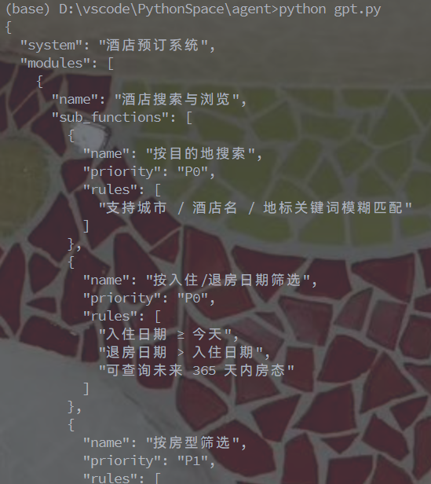
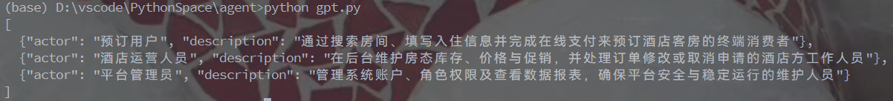
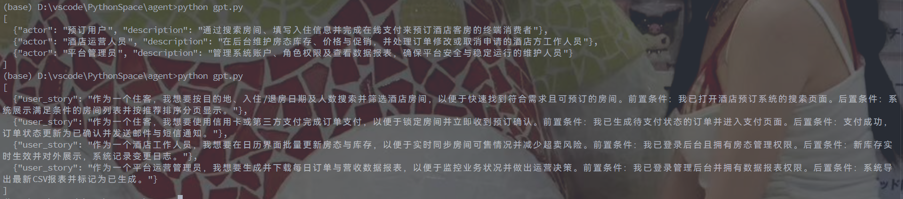
最终的需求模型如下：

用例图如下：

系统运行截图如下：
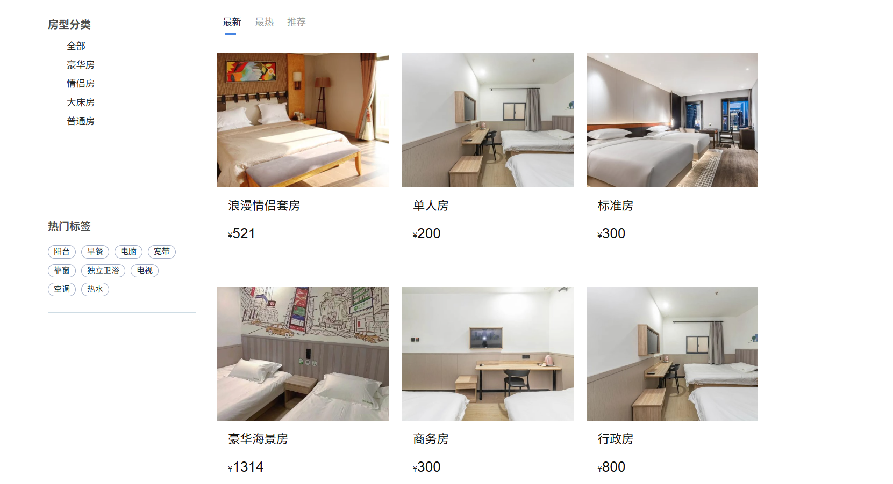
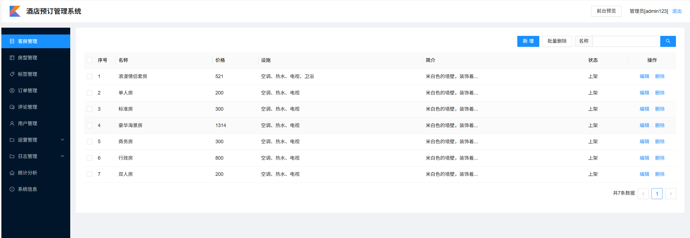


